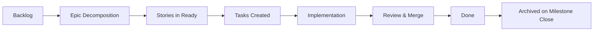

# GitHub Projects Board Structure

**Last Updated**: 2025-10-04
**Version**: 2.0.0
**Status**: Active

## 📋 Overview

MoneyWise uses GitHub Projects (v2) for agile project management with a Kanban-style board optimized for epic-driven development with multi-agent orchestration.

## 🎯 Board Philosophy

**Principles**:
- **Epic-Driven**: Work organized by epics (high-level capabilities)
- **Story-Centric**: User stories represent user value
- **Task-Atomic**: Tasks are small, testable, independent units
- **CI/CD-Gated**: No item moves to "Done" without green CI/CD
- **Agent-Optimized**: Structure supports multi-agent coordination

## 📊 Board Columns

### 1️⃣ Backlog

**Purpose**: Long-term work not yet prioritized for current sprint/milestone

**Contents**:
- Future epics (EPIC-005+)
- Nice-to-have features
- Technical debt items (non-critical)
- Research spikes
- Enhancement requests

**Entry Criteria**:
- Clearly defined objective
- Labeled appropriately (epic/story/task)
- Not blocking current milestone

**Exit Criteria**:
- Prioritized for sprint/milestone
- Dependencies identified
- Moved to "Ready"

**Example Items**:
- [EPIC-004] Milestone 2 - Core Finance Features (NEW)
- Future integrations (Plaid, Stripe)
- Mobile app enhancements

---

### 2️⃣ Ready

**Purpose**: Work ready to start, dependencies met, well-defined

**Contents**:
- Epics ready for decomposition
- Stories ready for implementation
- Tasks with clear acceptance criteria
- Groomed and estimated work

**Entry Criteria**:
- All dependencies satisfied
- Acceptance criteria defined
- Assigned to milestone/sprint
- Technical approach documented (for epics/stories)

**Exit Criteria**:
- Agent/developer starts work
- Moved to "In Progress"

**WIP Limit**: None (queue of ready work)

**Example Items**:
- Stories from EPIC-004 after decomposition
- Bug fixes from production monitoring
- Refactoring tasks from technical debt review

---

### 3️⃣ In Progress

**Purpose**: Active development work

**Contents**:
- Stories being implemented
- Tasks being coded/tested
- Epics being decomposed
- Work with active commits

**Entry Criteria**:
- Assigned to agent/developer
- Feature branch created
- Work actively started

**Exit Criteria**:
- PR created and reviewed
- All tests passing locally
- Moved to "In Review"

**WIP Limit**: 3-5 items (prevent context switching)

**Best Practices**:
- Update daily (via commit activity)
- Block if dependencies discovered
- Link to active PRs
- Comment on blockers immediately

**Example Items**:
- Currently: None (M1 complete, M2 planning)
- Future: Active story implementations

---

### 4️⃣ In Review

**Purpose**: Work awaiting code review and CI/CD validation

**Contents**:
- PRs awaiting review
- Work with passing local tests
- Code ready for merge consideration

**Entry Criteria**:
- PR created with description
- All CI/CD checks triggered
- Self-review completed
- Tests passing locally

**Exit Criteria**:
- PR approved by reviewer(s)
- All CI/CD workflows GREEN
- Conflicts resolved
- Ready to merge

**WIP Limit**: 5-10 items (review bandwidth)

**CI/CD Requirements**:
```yaml
Required Workflows (ALL must pass):
  - Foundation Health Check
  - Security Pipeline
  - Development Pipeline (TypeScript, ESLint, Prettier)
  - Testing Pipeline (1571+ tests)
  - Build Pipeline (web, backend, mobile)
  - Pipeline Summary
```

**Example Items**:
- Currently: None (PR #94 merged)
- Future: Feature PRs from M2 stories

---

### 5️⃣ Done

**Purpose**: Completed and merged work from current milestone

**Contents**:
- Merged PRs from current milestone
- Completed epics/stories/tasks
- Work deployed to develop branch
- Released features (with version tags)

**Entry Criteria**:
- PR merged to target branch
- All CI/CD workflows GREEN
- Work deployed (develop or main)
- Release notes updated (if applicable)

**Exit Criteria**:
- Milestone completes → Move to "Archived"
- End of sprint → Clear to "Archived"

**Retention Policy**: Current milestone only

**Example Items**:
- [EPIC-003] Milestone 1 Foundation (COMPLETE)
- All 6 M1 stories (STORY-001 through STORY-006)
- Issues #56, #57, #58, #59, #60 (closed)
- Issues #96, #97 (release tracking)

---

### 6️⃣ Archived

**Purpose**: Historical record of completed work from past milestones

**Contents**:
- Completed epics from previous milestones
- Obsolete/cancelled work
- Duplicate issues
- Historical documentation

**Entry Criteria**:
- Work completed in previous milestone
- No longer relevant to current development
- Marked for historical record

**Exit Criteria**: None (permanent archive)

**Organization**:
- Group by milestone/epic
- Tag with completion date
- Link to release notes

**Example Items**:
- [EPIC-001] Initial Repository Setup (M0)
- [EPIC-002] Documentation Organization (M0)
- Issue #55 (duplicate, closed)
- Issue #73 (CI/CD failures, resolved)

---

## 🏷️ Labeling Strategy

### Epic Labels
- `epic` - High-level capability grouping
- `epic-001`, `epic-002`, etc. - Specific epic tracking
- `milestone-N` - Milestone association

### Story Labels
- `story` - User story
- `enhancement` - Feature addition
- `infrastructure` - Platform/tooling work

### Task Labels
- `task` - Atomic work unit
- `bug` - Defect fix
- `hotfix` - Critical production fix
- `refactor` - Code improvement without functional change

### Priority Labels
- `critical` - Blocking/security issues
- `priority-high` - Current sprint/milestone
- `priority-medium` - Next sprint/milestone
- `priority-low` - Backlog

### Type Labels
- `documentation` - Docs updates
- `ci-cd` - Pipeline/automation
- `security` - Security-related
- `dependencies` - Dependency updates
- `automation` - Development automation

### Status Labels
- `review` - PR awaiting review
- `blocked` - Cannot proceed (state reason in comments)
- `backlog` - Deprioritized work

---

## 📈 Workflow Automation

### Auto-Move Rules (GitHub Actions)

```yaml
# .github/workflows/project-automation.yml

PR Opened:
  - Move linked issue → "In Review"

PR Merged:
  - Move linked issue → "Done"
  - Close issue (if not epic/story)

Issue Closed (not via PR):
  - Verify closure reason
  - Move to "Done" or "Archived" based on milestone

Epic Decomposed:
  - Create child stories
  - Link to epic
  - Move stories to "Ready"
```

### Manual Review Points

**Weekly Board Review** (Every Monday):
- [ ] Clear "Done" items to "Archived" if from previous milestone
- [ ] Verify "In Progress" WIP limit (≤5 items)
- [ ] Check "In Review" for stale PRs (>3 days)
- [ ] Groom "Ready" queue (priority order)

**Milestone Transitions**:
- [ ] Move all completed milestone work to "Archived"
- [ ] Create new milestone epic in "Backlog"
- [ ] Decompose next milestone epic to stories in "Ready"

---

## 🎯 Board Health Metrics

### Accuracy Score

**Formula**: (Correct Status Items / Total Items) × 100

**Target**: ≥90% accuracy

**Measurements**:
- "In Progress" items should have active commits (≤3 days old)
- "In Review" items should have open PRs
- "Done" items should have merged PRs or closed status
- "Backlog" items should NOT be blocking current milestone

### Flow Efficiency

**Formula**: (Active Work Time / Total Cycle Time) × 100

**Target**: ≥70%

**Tracking**:
- Cycle time: "Ready" → "Done"
- Active time: Time in "In Progress" + "In Review"
- Wait time: Time waiting for review or blocked

### WIP Management

**Limits**:
- **In Progress**: 3-5 items (strict)
- **In Review**: 5-10 items (soft limit)

**Alerts**:
- WIP limit exceeded → Review and consolidate
- Item in "In Progress" >7 days → Check for blockers

---

## 🚀 Epic-Driven Workflow

### Epic Lifecycle



### Epic Decomposition Process

1. **Epic Created**: High-level capability definition
   - Add to "Backlog"
   - Label: `epic`, `milestone-N`
   - Define success criteria

2. **Epic Planning**: User story breakdown
   - Move to "Ready"
   - Create user stories (STORY-XXX)
   - Link stories to epic
   - Define acceptance criteria per story

3. **Story Decomposition**: Task creation
   - For each story, create atomic tasks
   - Tasks should be ≤1 day work
   - Link tasks to story
   - Assign to agents/developers

4. **Parallel Execution**: Multi-agent coordination
   - Stories can be worked in parallel
   - Tasks within story can be parallel (if independent)
   - Use project-orchestrator agent for coordination

5. **Epic Completion**: All stories done
   - Verify all stories completed
   - Integration testing
   - Documentation complete
   - Move epic to "Done"

6. **Milestone Closure**: Epic archived
   - Move to "Archived"
   - Tag with completion date
   - Link to release notes

---

## 📊 Current Board Status (2025-10-04)

### After Board Cleanup Session

**Total Items**: 11 (after closing 8 obsolete issues)

**Distribution**:
- **Backlog**: 1 item
  - [EPIC-004] Milestone 2 planning (#98)

- **Ready**: 0 items
  - (M2 stories not yet decomposed)

- **In Progress**: 0 items
  - (M1 complete, M2 not started)

- **In Review**: 0 items
  - (PR #94 merged)

- **Done**: 8 items
  - [EPIC-003] Milestone 1 Foundation (#61)
  - 6 M1 stories (STORY-001 through STORY-006)
  - Release tracking: v0.4.6 (#96), v0.4.7 (#97)

- **Archived**: 2 items
  - [EPIC-001] Initial Setup
  - [EPIC-002] Documentation Organization

**Accuracy Score**: 100% (all items correctly reflect actual status)

**Next Actions**:
1. Decompose EPIC-004 into user stories
2. Move stories to "Ready"
3. Begin M2 sprint planning
4. Start story implementation

---

## 🔧 Board Maintenance Tools

### CLI Commands

```bash
# View board status
gh project view 3 --owner kdantuono

# List all items
gh project item-list 3 --owner kdantuono --format json

# View specific issue
gh issue view <issue-number>

# Close obsolete issue
gh issue close <issue-number> --comment "Reason for closure"

# Create new tracking issue
gh issue create --title "[TYPE] Title" --label "labels" --body "Description"
```

### Backup & Restore

```bash
# Backup board state (before major changes)
gh project item-list 3 --owner kdantuono --format json > .claude/backups/board-state-$(date +%Y%m%d-%H%M%S).json

# Backup issue status
gh issue list --state all --json number,title,state,labels --limit 100 > .claude/backups/issue-status-$(date +%Y%m%d-%H%M%S).json
```

### Health Check Script

```bash
# .claude/tools/board-health-check.sh

#!/bin/bash
# Check board health metrics

echo "=== Board Health Check ==="

# Check WIP limits
IN_PROGRESS=$(gh project item-list 3 --owner kdantuono --format json | jq '[.[] | select(.status == "In Progress")] | length')
echo "In Progress: $IN_PROGRESS / 5 (limit)"

# Check stale PRs
STALE_PRS=$(gh pr list --state open --json number,createdAt | jq '[.[] | select((now - (.createdAt | fromdateiso8601)) > (3 * 86400))] | length')
echo "Stale PRs (>3 days): $STALE_PRS"

# Board accuracy
echo "Run manual validation for accuracy score"
```

---

## 📚 References

- **GitHub Projects v2 Docs**: https://docs.github.com/en/issues/planning-and-tracking-with-projects
- **Agile Board Best Practices**: https://www.atlassian.com/agile/kanban/boards
- **Epic-Driven Development**: `.claude/workflows/epic-workflow.md`
- **Multi-Agent Orchestration**: `.claude/orchestration/README.md`

---

## 🤖 Agent Integration

Specialized agents use this board structure for:

**project-orchestrator**:
- Epic decomposition
- Story parallelization
- Task assignment
- Progress tracking

**product-manager**:
- Board health monitoring
- Accuracy validation
- Workflow optimization
- Issue lifecycle management

**quality-evolution-specialist**:
- Board accuracy audits
- Process improvement
- Incident tracking
- Technical debt management

---

**Version**: 2.0.0
**Maintained by**: MoneyWise Development Team
**Last Review**: 2025-10-04
**Next Review**: 2025-11-04 (monthly)

🤖 Generated with [Claude Code](https://claude.com/claude-code)
