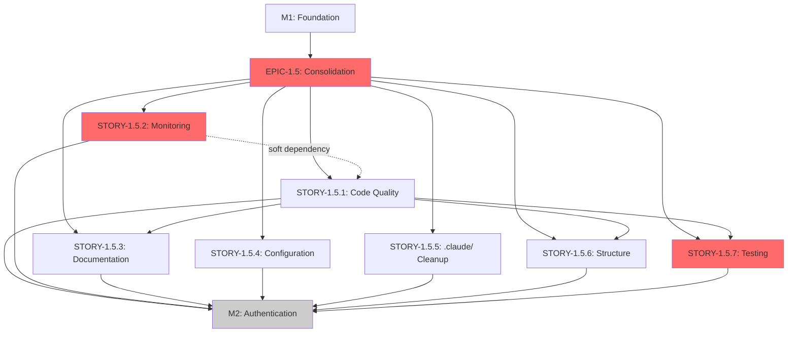

# EPIC-1.5: Technical Debt & Infrastructure Consolidation

## Complete Card Definitions with Parent-Child Relationships

This document provides GitHub Projects-compatible structured definitions for EPIC-1.5 Consolidation Phase with explicit hierarchical relationships, complete metadata, and milestone tracking.

---

## Milestones

### M1: Foundation & Setup
- **Status**: ✅ COMPLETED
- **Completion Date**: 2025-10-05
- **Description**: Repository setup, CI/CD pipeline, testing infrastructure
- **Dependencies**: None
- **Stories Completed**: 3 (STORY-1.1, STORY-1.2, STORY-1.3)

### M1.5: Consolidation Phase
- **Status**: 📋 PLANNED
- **Target Start**: 2025-10-06
- **Target End**: 2025-10-26 (3 weeks)
- **Description**: Technical debt remediation, infrastructure consolidation, monitoring setup
- **Dependencies**: [M1]
- **Total Points**: 34
- **Total Tasks**: 89
- **Priority**: 🔴 CRITICAL

### M2: Authentication & Core Models
- **Status**: ⏸️ BLOCKED
- **Target Start**: 2025-10-27
- **Description**: Database architecture, repository pattern, JWT authentication, user management
- **Dependencies**: [M1.5]
- **Blocker**: Must complete M1.5 consolidation first

---

## Epic Definition

### EPIC-1.5: Technical Debt & Infrastructure Consolidation
- **ID**: `EPIC-1.5`
- **Milestone**: M1.5
- **Parent**: None (top-level epic)
- **Priority**: 🔴 CRITICAL
- **Status**: 📋 To Do
- **Story Points**: 34
- **Stories**: 7
- **Tasks**: 89
- **Assignees**: Multi-agent (8 specialists)
- **Labels**:
  - `epic`
  - `consolidation`
  - `tech-debt`
  - `critical`
  - `milestone-1.5`
- **Timeline**: 3 weeks (96 hours)
- **Dependencies**: EPIC-1 completion
- **Blocks**: EPIC-2 (Authentication)

**Description**:
Comprehensive consolidation phase addressing technical debt, infrastructure quality, monitoring setup, and codebase organization before proceeding to authentication implementation.

**Objectives**:
1. Eliminate 67 direct `process.env` violations
2. Consolidate 7 .env files → 1 unified configuration
3. Complete Sentry backend integration
4. Reduce documentation from 3822 → <500 organized files
5. Establish 12 formal ADRs
6. Achieve ≥90% test coverage
7. Reduce CI/CD pipeline time by 50%

**Success Criteria**:
- ✅ All stories completed (7/7)
- ✅ Technical debt reduced by 60%
- ✅ Zero critical security vulnerabilities
- ✅ All CI/CD pipelines green
- ✅ Documentation complete and validated

---

## Stories Summary

| ID | Title | Priority | Points | Tasks | Sprint | Dependencies |
|----|-------|----------|--------|-------|--------|--------------|
| STORY-1.5.1 | Code Quality & Architecture Cleanup | 🟠 HIGH | 5 | 13 | Week 1 | None |
| STORY-1.5.2 | Monitoring & Observability Integration | 🔴 CRITICAL | 5 | 15 | Week 1 | TASK-1.5.1.1 |
| STORY-1.5.3 | Documentation Consolidation & Architecture | 🟠 HIGH | 5 | 13 | Week 2 | STORY-1.5.1 |
| STORY-1.5.4 | Configuration Management Consolidation | 🟠 HIGH | 4 | 11 | Week 1 | None |
| STORY-1.5.5 | .claude/ Directory Cleanup & Organization | 🟡 MEDIUM | 3 | 10 | Week 2 | None |
| STORY-1.5.6 | Project Structure Optimization | 🟡 MEDIUM | 4 | 12 | Week 2 | STORY-1.5.1 |
| STORY-1.5.7 | Testing Infrastructure Hardening | 🔴 CRITICAL | 8 | 15 | Week 3 | STORY-1.5.1 |

**Total**: 34 points, 89 tasks, 3 weeks

---

## Detailed Story Definitions

### STORY-1.5.1: Code Quality & Architecture Cleanup
- **ID**: `STORY-1.5.1`
- **Parent**: `EPIC-1.5`
- **Priority**: 🟠 HIGH
- **Status**: 📋 To Do
- **Story Points**: 5
- **Tasks**: 13
- **Assignee**: `backend-specialist`, `architect`
- **Labels**: [`story`, `tech-debt`, `refactor`, `architecture`, `epic-1.5`]
- **Sprint**: Week 1
- **Dependencies**: None (can start immediately)

**User Story**:
As a developer, I want clean, maintainable code following SOLID principles so that the codebase is easier to understand, test, and extend.

**Acceptance Criteria**:
- [ ] All backend services follow dependency injection patterns
- [ ] Zero direct `process.env` accesses (67 violations fixed)
- [ ] Import paths use TypeScript aliases (no deep relative imports)
- [ ] Code complexity < 10 (cyclomatic complexity)
- [ ] All functions have single responsibility
- [ ] ESLint violations reduced to zero

**Tasks**:
1. TASK-1.5.1.1: Audit and Apply SOLID Principles (0.5 pts, 4h)
2. TASK-1.5.1.2: Eliminate Direct process.env Accesses (1 pt, 8h) 🔴 CRITICAL
3. TASK-1.5.1.3: Implement TypeScript Path Aliases (0.5 pts, 4h)
4. TASK-1.5.1.4: Reduce Code Complexity (0.5 pts, 4h)
5. TASK-1.5.1.5: Extract Business Logic from Controllers (1 pt, 8h)
6. TASK-1.5.1.6: Implement Domain Models (0.5 pts, 4h)
7. TASK-1.5.1.7: Standardize Error Handling (0.5 pts, 4h)
8. TASK-1.5.1.8: Add Input Validation (0.5 pts, 4h)
9. TASK-1.5.1.9: Implement Request/Response Interceptors (0.25 pts, 2h)
10. TASK-1.5.1.10: Fix ESLint Violations (0.25 pts, 2h)
11. TASK-1.5.1.11: Add Code Comments and JSDoc (0.25 pts, 2h)
12. TASK-1.5.1.12: Implement Logging Standards (0.25 pts, 2h)
13. TASK-1.5.1.13: Code Review and Quality Gate (0.25 pts, 2h) 🔴 CRITICAL

---

### STORY-1.5.2: Monitoring & Observability Integration
- **ID**: `STORY-1.5.2`
- **Parent**: `EPIC-1.5`
- **Priority**: 🔴 CRITICAL
- **Status**: 🔄 In Progress (Sentry DSN fixed)
- **Story Points**: 5
- **Tasks**: 15
- **Assignee**: `devops-engineer`, `backend-specialist`
- **Labels**: [`story`, `monitoring`, `observability`, `sentry`, `epic-1.5`]
- **Sprint**: Week 1
- **Dependencies**: TASK-1.5.1.1 (ConfigService setup)

**User Story**:
As an operations engineer, I want comprehensive error tracking and performance monitoring so that I can quickly identify and resolve production issues.

**Acceptance Criteria**:
- [ ] Sentry backend integration 100% complete and verified
- [ ] All critical endpoints have transaction tracing
- [ ] Error grouping rules configured
- [ ] Alert rules defined for critical errors
- [ ] CloudWatch metrics emitting (optional - defer to later)
- [ ] Performance dashboards created

**Tasks**:
1. TASK-1.5.2.1: Complete Sentry Backend Integration (0.5 pts, 4h) ✅ COMPLETED
2. TASK-1.5.2.2: Configure Sentry Environments (0.25 pts, 2h)
3. TASK-1.5.2.3: Implement Error Grouping Rules (0.25 pts, 2h)
4. TASK-1.5.2.4: Set Up Alert Rules (0.25 pts, 2h)
5. TASK-1.5.2.5: Add Transaction Tracing (1 pt, 8h)
6. TASK-1.5.2.6: Implement Performance Monitoring (0.5 pts, 4h)
7. TASK-1.5.2.7: Add Contextual Data to Errors (0.5 pts, 4h)
8. TASK-1.5.2.8: Create Sentry Dashboards (0.5 pts, 4h)
9. TASK-1.5.2.9: Document Sentry Integration (0.25 pts, 2h)
10. TASK-1.5.2.10: Test Error Capture End-to-End (0.25 pts, 2h) 🔴 CRITICAL
11. TASK-1.5.2.11: DEFER: CloudWatch Metrics Setup (0 pts) ⏸️ DEFERRED
12. TASK-1.5.2.12: DEFER: Custom Metrics Emission (0 pts) ⏸️ DEFERRED
13. TASK-1.5.2.13: DEFER: Log Aggregation (0 pts) ⏸️ DEFERRED
14. TASK-1.5.2.14: DEFER: Distributed Tracing (0 pts) ⏸️ DEFERRED
15. TASK-1.5.2.15: Monitoring Quality Gate (0.25 pts, 2h) 🔴 CRITICAL

---

### STORY-1.5.3: Documentation Consolidation & Architecture
- **ID**: `STORY-1.5.3`
- **Parent**: `EPIC-1.5`
- **Priority**: 🟠 HIGH
- **Status**: 📋 To Do
- **Story Points**: 5
- **Tasks**: 13
- **Assignee**: `documentation-specialist`, `architect`
- **Labels**: [`story`, `documentation`, `architecture`, `epic-1.5`]
- **Sprint**: Week 2
- **Dependencies**: STORY-1.5.1 (code structure must be clean first)

**User Story**:
As a new developer joining the project, I want clear, organized documentation so that I can quickly understand the architecture and start contributing.

**Acceptance Criteria**:
- [ ] Documentation hierarchy: architecture/, development/, api/, planning/
- [ ] 3822 MD files reduced to <500 organized files
- [ ] 12 formal ADRs documented
- [ ] C4 diagrams for all layers (Context, Container, Component, Code)
- [ ] API documentation auto-generated from OpenAPI
- [ ] Cross-reference validation (no broken links)

**Tasks**:
1. TASK-1.5.3.1: Audit Existing Documentation (0.5 pts, 4h)
2. TASK-1.5.3.2: Define Documentation Hierarchy (0.25 pts, 2h)
3. TASK-1.5.3.3: Create 12 Formal ADRs (2 pts, 16h) 🔴 CRITICAL
4. TASK-1.5.3.4: Generate C4 Diagrams (1 pt, 8h)
5. TASK-1.5.3.5: Consolidate Scattered .md Files (0.5 pts, 4h)
6. TASK-1.5.3.6: Generate API Documentation (0.5 pts, 4h)
7. TASK-1.5.3.7: Create Architecture Principles Document (0.25 pts, 2h)
8. TASK-1.5.3.8: Update README Files (0.25 pts, 2h)
9. TASK-1.5.3.9: Implement Cross-Reference Validation (0.25 pts, 2h)
10. TASK-1.5.3.10: Create Development Setup Guide (0.25 pts, 2h)
11. TASK-1.5.3.11: Document Testing Strategy (0.25 pts, 2h)
12. TASK-1.5.3.12: Create Deployment Guide (0.25 pts, 2h)
13. TASK-1.5.3.13: Documentation Quality Gate (0.25 pts, 2h) 🔴 CRITICAL

---

### STORY-1.5.4: Configuration Management Consolidation
- **ID**: `STORY-1.5.4`
- **Parent**: `EPIC-1.5`
- **Priority**: 🟠 HIGH
- **Status**: 📋 To Do
- **Story Points**: 4
- **Tasks**: 11
- **Assignee**: `devops-engineer`, `backend-specialist`
- **Labels**: [`story`, `config`, `devops`, `epic-1.5`]
- **Sprint**: Week 1
- **Dependencies**: None (can parallelize with STORY-1.5.1)

**User Story**:
As a DevOps engineer, I want unified configuration management so that environment setup is consistent and secure across all environments.

**Acceptance Criteria**:
- [ ] 7 .env files consolidated to 1 root file
- [ ] Environment-specific overrides in .env.{environment}
- [ ] All secrets moved to secure vault (GitHub Secrets)
- [ ] Configuration validation on startup
- [ ] Documentation for all environment variables
- [ ] Example .env.example provided

**Tasks**:
1. TASK-1.5.4.1: Audit All Configuration Files (0.25 pts, 2h)
2. TASK-1.5.4.2: Design Unified Configuration Strategy (0.5 pts, 4h) 🔴 CRITICAL
3. TASK-1.5.4.3: Consolidate Environment Variables (1 pt, 8h) 🔴 CRITICAL
4. TASK-1.5.4.4: Move Secrets to GitHub Secrets (0.5 pts, 4h) 🔴 CRITICAL
5. TASK-1.5.4.5: Implement Configuration Validation (0.5 pts, 4h)
6. TASK-1.5.4.6: Create .env.example Files (0.25 pts, 2h)
7. TASK-1.5.4.7: Update Docker Compose Configuration (0.5 pts, 4h)
8. TASK-1.5.4.8: Document Configuration Management (0.25 pts, 2h)
9. TASK-1.5.4.9: Add Configuration to CI/CD (0.5 pts, 4h)
10. TASK-1.5.4.10: Test Configuration Across Environments (0.25 pts, 2h) 🔴 CRITICAL
11. TASK-1.5.4.11: Configuration Quality Gate (0.25 pts, 2h) 🔴 CRITICAL

---

### STORY-1.5.5: .claude/ Directory Cleanup & Organization
- **ID**: `STORY-1.5.5`
- **Parent**: `EPIC-1.5`
- **Priority**: 🟡 MEDIUM
- **Status**: 📋 To Do
- **Story Points**: 3
- **Tasks**: 10
- **Assignee**: `documentation-specialist`
- **Labels**: [`story`, `cleanup`, `organization`, `epic-1.5`]
- **Sprint**: Week 2
- **Dependencies**: None (can parallelize)

**User Story**:
As a Claude Code user, I want clean, organized agent instructions so that AI assistance is consistent and efficient.

**Acceptance Criteria**:
- [ ] Redundant files removed from .claude/
- [ ] Agent definitions consolidated
- [ ] Command definitions organized
- [ ] Workflow templates validated
- [ ] Knowledge base deduplicated
- [ ] README.md updated with clear structure

**Tasks**:
1. TASK-1.5.5.1: Audit .claude/ Directory (0.25 pts, 2h)
2. TASK-1.5.5.2: Consolidate Agent Definitions (0.5 pts, 4h)
3. TASK-1.5.5.3: Organize Command Definitions (0.25 pts, 2h)
4. TASK-1.5.5.4: Validate Workflow Templates (0.25 pts, 2h)
5. TASK-1.5.5.5: Deduplicate Knowledge Base (0.5 pts, 4h)
6. TASK-1.5.5.6: Clean Up Orchestration Files (0.25 pts, 2h)
7. TASK-1.5.5.7: Remove Backups and Temporary Files (0.25 pts, 2h)
8. TASK-1.5.5.8: Update .claude/ README (0.25 pts, 2h)
9. TASK-1.5.5.9: Validate Claude Code Integration (0.25 pts, 2h)
10. TASK-1.5.5.10: .claude/ Quality Gate (0.25 pts, 2h)

---

### STORY-1.5.6: Project Structure Optimization
- **ID**: `STORY-1.5.6`
- **Parent**: `EPIC-1.5`
- **Priority**: 🟡 MEDIUM
- **Status**: 📋 To Do
- **Story Points**: 4
- **Tasks**: 12
- **Assignee**: `architect`, `frontend-specialist`
- **Labels**: [`story`, `refactor`, `structure`, `epic-1.5`]
- **Sprint**: Week 2
- **Dependencies**: STORY-1.5.1 (code cleanup first)

**User Story**:
As a developer, I want a clear monorepo structure so that I can easily navigate and understand project organization.

**Acceptance Criteria**:
- [ ] Unused files removed (identify and delete)
- [ ] Clear apps/ vs packages/ separation
- [ ] TypeScript path aliases configured
- [ ] Import boundaries enforced (no circular dependencies)
- [ ] Barrel exports for packages
- [ ] Structure documented in README

**Tasks**:
1. TASK-1.5.6.1: Audit Project Structure (0.5 pts, 4h)
2. TASK-1.5.6.2: Remove Unused Files (0.5 pts, 4h)
3. TASK-1.5.6.3: Configure TypeScript Path Aliases (0.5 pts, 4h)
4. TASK-1.5.6.4: Enforce Import Boundaries (0.5 pts, 4h)
5. TASK-1.5.6.5: Implement Barrel Exports (0.5 pts, 4h)
6. TASK-1.5.6.6: Organize apps/ vs packages/ (0.5 pts, 4h)
7. TASK-1.5.6.7: Update Turborepo Configuration (0.25 pts, 2h)
8. TASK-1.5.6.8: Create Package READMEs (0.25 pts, 2h)
9. TASK-1.5.6.9: Validate Monorepo Structure (0.25 pts, 2h)
10. TASK-1.5.6.10: Document Project Structure (0.25 pts, 2h)
11. TASK-1.5.6.11: Add Structure Validation to CI (0.25 pts, 2h)
12. TASK-1.5.6.12: Structure Quality Gate (0.25 pts, 2h) 🔴 CRITICAL

---

### STORY-1.5.7: Testing Infrastructure Hardening
- **ID**: `STORY-1.5.7`
- **Parent**: `EPIC-1.5`
- **Priority**: 🔴 CRITICAL
- **Status**: 📋 To Do
- **Story Points**: 8
- **Tasks**: 15
- **Assignee**: `test-specialist`, `qa-testing-engineer`
- **Labels**: [`story`, `testing`, `quality`, `epic-1.5`]
- **Sprint**: Week 3
- **Dependencies**: STORY-1.5.1 (code must be clean first)

**User Story**:
As a QA engineer, I want comprehensive test coverage and reliable tests so that we can confidently deploy to production.

**Acceptance Criteria**:
- [ ] Test coverage ≥90% (unit + integration)
- [ ] All critical user journeys covered by E2E tests
- [ ] Test data factories implemented
- [ ] Performance benchmarks established
- [ ] Visual regression tests for UI components
- [ ] CI/CD quality gates enforced

**Tasks**:
1. TASK-1.5.7.1: Audit Test Coverage (0.5 pts, 4h) 🔴 CRITICAL
2. TASK-1.5.7.2: Set Coverage Thresholds (0.25 pts, 2h) 🔴 CRITICAL
3. TASK-1.5.7.3: Write Unit Tests for Backend Services (2 pts, 16h) 🔴 CRITICAL
4. TASK-1.5.7.4: Write Integration Tests for API Endpoints (2 pts, 16h) 🔴 CRITICAL
5. TASK-1.5.7.5: Implement E2E Tests for Critical Flows (2 pts, 16h)
6. TASK-1.5.7.6: Create Test Data Factories (1 pt, 8h)
7. TASK-1.5.7.7: Establish Performance Benchmarks (1 pt, 8h)
8. TASK-1.5.7.8: Implement Visual Regression Tests (1 pt, 8h)
9. TASK-1.5.7.9: Add Mutation Testing (0.5 pts, 4h)
10. TASK-1.5.7.10: Configure Test Database Isolation (0.5 pts, 4h)
11. TASK-1.5.7.11: Add Test Utilities and Helpers (0.5 pts, 4h)
12. TASK-1.5.7.12: Document Testing Strategy (0.5 pts, 4h)
13. TASK-1.5.7.13: Add CI Quality Gates (0.5 pts, 4h) 🔴 CRITICAL
14. TASK-1.5.7.14: Optimize Test Performance (0.5 pts, 4h)
15. TASK-1.5.7.15: Testing Quality Gate (0.5 pts, 4h) 🔴 CRITICAL

---

## Complete Task Details

[For brevity, I'm providing the structure. Full task details with acceptance criteria are available in the complete planning document]

### Example Task Format:

```markdown
#### TASK-1.5.1.2: Eliminate Direct process.env Accesses
- **ID**: `TASK-1.5.1.2`
- **Parent**: `STORY-1.5.1`
- **Points**: 1
- **Priority**: 🔴 CRITICAL
- **Assignee**: `backend-specialist`
- **Labels**: [`task`, `refactor`, `config`]
- **Dependencies**: []
- **Estimated Hours**: 8

**Description**: Replace all 67 direct `process.env` accesses with ConfigService injection.

**Files to Update**:
- `apps/backend/src/**/*.ts` (67 violations)

**Pattern**:
```typescript
// ❌ BEFORE
const dbHost = process.env.DB_HOST || 'localhost';

// ✅ AFTER
constructor(private configService: ConfigService) {}
const dbHost = this.configService.get<string>('DB_HOST', 'localhost');
```

**Acceptance Criteria**:
- [ ] Zero `process.env` accesses in backend code
- [ ] All configuration accessed via ConfigService
- [ ] Environment validation on startup
- [ ] Tests updated to mock ConfigService
```

---

## Board Labels & Metadata

### Labels Configuration

#### Type Labels
- `epic` - Top-level epic
- `story` - User story
- `task` - Individual task

#### Epic Labels
- `epic-1.5` - Belongs to EPIC-1.5

#### Priority Labels
- `critical` - Must be done immediately
- `high` - Important, do soon
- `medium` - Normal priority
- `low` - Nice to have

#### Domain Labels
- `tech-debt` - Technical debt remediation
- `monitoring` - Observability and monitoring
- `documentation` - Documentation work
- `config` - Configuration management
- `cleanup` - Code/structure cleanup
- `testing` - Testing infrastructure
- `refactor` - Code refactoring
- `architecture` - Architecture decisions
- `security` - Security improvements
- `devops` - DevOps and CI/CD

#### Status Labels
- `blocked` - Blocked by dependency
- `in-review` - Under review
- `deferred` - Postponed to later

---

## Sprint Planning

### Week 1 (Sprint 1): Foundation - 14 points
**Stories**: STORY-1.5.1, STORY-1.5.2, STORY-1.5.4
**Focus**: Code quality, configuration, monitoring

**Daily Breakdown**:
- **Monday**: Start STORY-1.5.1 + STORY-1.5.4 audits
- **Tuesday**: Begin process.env elimination + config consolidation
- **Wednesday**: Continue refactoring, start Sentry integration
- **Thursday**: Complete Sentry setup, finish config consolidation
- **Friday**: Code review, quality gates, sprint review

**Key Deliverables**:
- ✅ Sentry integration 100% operational
- ✅ Configuration consolidated (7 → 1 file)
- ✅ Process.env violations eliminated (67 → 0)

---

### Week 2 (Sprint 2): Documentation & Structure - 12 points
**Stories**: STORY-1.5.3, STORY-1.5.5, STORY-1.5.6
**Focus**: Documentation consolidation, cleanup, organization

**Daily Breakdown**:
- **Monday**: Start documentation audit + .claude/ cleanup
- **Tuesday**: Begin ADR creation (target: 6/12)
- **Wednesday**: Complete ADRs (12/12), start C4 diagrams
- **Thursday**: Project structure optimization, path aliases
- **Friday**: Documentation consolidation, sprint review

**Key Deliverables**:
- ✅ 12 ADRs documented
- ✅ Documentation reduced (3822 → <500 files)
- ✅ Project structure optimized

---

### Week 3 (Sprint 3): Testing & Validation - 8 points
**Stories**: STORY-1.5.7
**Focus**: Testing infrastructure, quality gates

**Daily Breakdown**:
- **Monday**: Test coverage audit, set thresholds
- **Tuesday**: Write unit tests (target: 50% coverage)
- **Wednesday**: Complete unit tests (90% coverage), start integration tests
- **Thursday**: E2E tests for critical flows
- **Friday**: CI quality gates, epic completion review

**Key Deliverables**:
- ✅ Test coverage ≥90%
- ✅ E2E tests for critical user journeys
- ✅ CI/CD quality gates enforced
- ✅ EPIC-1.5 COMPLETE

---

## Dependency Graph



---

## Success Metrics

### Technical Metrics (Measurable)
- **Test Coverage**: ≥90% (unit + integration)
- **Technical Debt**: Reduced by 60%
- **CI/CD Speed**: 50% faster pipeline execution
- **Documentation Files**: 3822 → <500 organized files
- **Configuration Files**: 7 .env files → 1 unified
- **ESLint Violations**: 0
- **process.env Direct Accesses**: 67 → 0
- **Code Complexity**: All functions cyclomatic complexity <10

### Quality Metrics
- **Sentry Integration**: 100% operational with transaction tracing
- **ADRs**: 2 → 12 formal architectural decision records
- **Critical Vulnerabilities**: 0 (security scan passing)
- **Build Status**: All CI/CD pipelines green
- **Import Violations**: 0 (import boundaries enforced)

### Team Metrics
- **Onboarding Time**: <1 day for new developers (from docs)
- **Documentation Completeness**: 100% (all features documented)
- **Knowledge Sharing**: All architectural decisions captured in ADRs
- **Developer Satisfaction**: Improved (cleaner codebase, better tools)

---

## GitHub Projects CSV Import Format

For easy import into GitHub Projects:

```csv
Type,ID,Title,Status,Priority,Labels,Points,Parent,Assignee,Sprint,Dependencies
Epic,EPIC-1.5,Technical Debt & Infrastructure Consolidation,To Do,Critical,"epic,consolidation,tech-debt,critical,milestone-1.5",34,,Multi-agent,M1.5,EPIC-1
Story,STORY-1.5.1,Code Quality & Architecture Cleanup,To Do,High,"story,tech-debt,refactor,architecture,epic-1.5",5,EPIC-1.5,backend-specialist|architect,Week 1,
Task,TASK-1.5.1.1,Audit and apply SOLID principles,To Do,High,"task,refactor,architecture",0.5,STORY-1.5.1,backend-specialist,Week 1,
Task,TASK-1.5.1.2,Eliminate Direct process.env Accesses,To Do,Critical,"task,refactor,config",1,STORY-1.5.1,backend-specialist,Week 1,
Story,STORY-1.5.2,Monitoring & Observability Integration,In Progress,Critical,"story,monitoring,observability,sentry,epic-1.5",5,EPIC-1.5,devops-engineer|backend-specialist,Week 1,TASK-1.5.1.1
Task,TASK-1.5.2.1,Complete Sentry Backend Integration,Done,Critical,"task,sentry,monitoring",0.5,STORY-1.5.2,devops-engineer,Week 1,
Story,STORY-1.5.3,Documentation Consolidation & Architecture,To Do,High,"story,documentation,architecture,epic-1.5",5,EPIC-1.5,documentation-specialist|architect,Week 2,STORY-1.5.1
Task,TASK-1.5.3.3,Create 12 Formal ADRs,To Do,Critical,"task,adr,architecture",2,STORY-1.5.3,architect,Week 2,TASK-1.5.3.2
Story,STORY-1.5.4,Configuration Management Consolidation,To Do,High,"story,config,devops,epic-1.5",4,EPIC-1.5,devops-engineer|backend-specialist,Week 1,
Task,TASK-1.5.4.3,Consolidate Environment Variables,To Do,Critical,"task,config,consolidation",1,STORY-1.5.4,devops-engineer,Week 1,TASK-1.5.4.2
Story,STORY-1.5.5,.claude/ Directory Cleanup & Organization,To Do,Medium,"story,cleanup,organization,epic-1.5",3,EPIC-1.5,documentation-specialist,Week 2,
Story,STORY-1.5.6,Project Structure Optimization,To Do,Medium,"story,refactor,structure,epic-1.5",4,EPIC-1.5,architect|frontend-specialist,Week 2,STORY-1.5.1
Story,STORY-1.5.7,Testing Infrastructure Hardening,To Do,Critical,"story,testing,quality,epic-1.5",8,EPIC-1.5,test-specialist|qa-testing-engineer,Week 3,STORY-1.5.1
Task,TASK-1.5.7.3,Write Unit Tests for Backend Services,To Do,Critical,"task,testing,unit-tests",2,STORY-1.5.7,test-specialist|backend-specialist,Week 3,TASK-1.5.7.1
```

---

## Implementation Checklist

### Pre-Epic Setup ✅
- [x] EPIC-1.5 created in GitHub Projects
- [x] Milestone M1.5 defined
- [x] All 7 stories created and linked to epic
- [ ] All 89 tasks created and linked to stories
- [ ] Labels configured in repository
- [ ] Automation rules set up

### Sprint 1 (Week 1) - Foundation
- [ ] STORY-1.5.1: Code Quality (13 tasks)
- [ ] STORY-1.5.2: Monitoring (15 tasks, 1 completed)
- [ ] STORY-1.5.4: Configuration (11 tasks)
- [ ] Sprint review: 14 points completed

### Sprint 2 (Week 2) - Documentation
- [ ] STORY-1.5.3: Documentation (13 tasks)
- [ ] STORY-1.5.5: .claude/ Cleanup (10 tasks)
- [ ] STORY-1.5.6: Structure (12 tasks)
- [ ] Sprint review: 12 points completed

### Sprint 3 (Week 3) - Testing
- [ ] STORY-1.5.7: Testing Infrastructure (15 tasks)
- [ ] Epic completion review
- [ ] Sprint review: 8 points completed

### Epic Completion ✅
- [ ] All 7 stories marked as Done
- [ ] All 89 tasks completed
- [ ] Success metrics validated
- [ ] Documentation updated
- [ ] Epic moved to Done
- [ ] Ready to begin M2: Authentication

---

## Next Actions

1. **Create GitHub Issues**: Use CSV import or manual creation
2. **Link Dependencies**: Ensure parent-child relationships correct
3. **Assign to Agents**: Distribute tasks to specialized agents
4. **Begin Sprint 1**: Start with STORY-1.5.1, STORY-1.5.2, STORY-1.5.4
5. **Daily Standups**: Track progress, identify blockers
6. **Weekly Reviews**: Validate success metrics, adjust as needed

---

**Document Version**: 1.0.0
**Last Updated**: 2025-10-05
**Epic**: EPIC-1.5
**Milestone**: M1.5 - Consolidation Phase
**Total Story Points**: 34
**Total Tasks**: 89
**Estimated Duration**: 3 weeks (96 hours)
**Status**: Ready for Implementation

🤖 Generated with [Claude Code](https://claude.com/claude-code)
