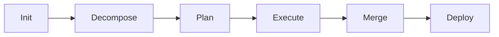

# Epic Workflow

## Overview
Complete workflow for executing epics from initialization to production deployment.

## Epic Lifecycle



## Phase 1: Initialization

### Trigger
```bash
claude "/epic:init [epic-name]"
```

### Actions
1. **Validate epic name** - Lowercase, hyphenated
2. **Create state structure** - `.claude/orchestration/state/epics/[name]`
3. **Initialize tracking** - Create state.json
4. **Generate epic ID** - UUID for tracking

### Output
```yaml
epic:
  id: uuid-v4
  name: user-authentication
  status: initialized
  created_at: ISO-8601
  created_by: orchestrator
```

## Phase 2: Decomposition

### Process
1. **Analyze epic requirements**
2. **Identify user stories**
3. **Break stories into tasks**
4. **Map dependencies**

### Story Template
```yaml
story:
  id: story-001
  title: User Registration
  points: 8
  acceptance_criteria:
    - User can register with email
    - Password meets security requirements
    - Email verification sent
  tasks:
    - Create user schema
    - Build registration API
    - Implement UI form
    - Add validation tests
```

### Task Template
```yaml
task:
  id: task-001
  story_id: story-001
  title: Create user schema
  agent: database-specialist
  dependencies: []
  estimated_hours: 2
  priority: high
```

## Phase 3: Planning

### Dependency Analysis
```python
def analyze_dependencies(tasks):
    graph = build_dependency_graph(tasks)
    critical_path = find_critical_path(graph)
    parallel_groups = identify_parallel_groups(graph)
    
    return {
        'critical_path': critical_path,
        'parallel_groups': parallel_groups,
        'estimated_duration': calculate_duration(critical_path)
    }
```

### Agent Allocation
```yaml
allocation_strategy:
  backend-specialist:
    max_concurrent: 3
    tasks_assigned: [task-002, task-005, task-008]
  frontend-specialist:
    max_concurrent: 2
    tasks_assigned: [task-003, task-006]
  database-specialist:
    max_concurrent: 1
    tasks_assigned: [task-001]
```

### Execution Schedule
```yaml
phase_1: [task-001]              # Database schema
phase_2: [task-002, task-005]    # Parallel backend work
phase_3: [task-003, task-006]    # Parallel frontend work
phase_4: [task-004, task-007]    # Testing
```

## Phase 4: Execution

### Setup Worktrees
```bash
.claude/scripts/spawn-worktree.sh [epic-name]
```

### Launch Orchestration
```bash
claude "/epic:execute [epic-name]"
```

### Parallel Execution Pattern
```yaml
while tasks_remaining:
  ready_tasks = find_tasks_with_satisfied_dependencies()
  
  for task in ready_tasks:
    if agent_available(task.required_agent):
      dispatch_agent(task)
    else:
      queue_task(task)
  
  wait_for_any_completion()
  process_completed_tasks()
```

### Task Execution Flow
```yaml
task_lifecycle:
  1. pending → assigned
  2. assigned → running
  3. running → testing
  4. testing → complete/failed
  
on_complete:
  - Mark task done
  - Release agent
  - Trigger dependent tasks
  - Merge to story branch
  
on_failure:
  - Capture logs
  - Attempt auto-fix
  - If unresolvable: block & alert
```

## Phase 5: Progressive Merging

### Merge Strategy
```yaml
task → story:
  trigger: Task complete
  validation: Unit tests
  merge_type: --no-ff
  
story → epic:
  trigger: All story tasks complete
  validation: Integration tests
  merge_type: --no-ff
  
epic → dev:
  trigger: All stories complete
  validation: E2E tests
  merge_type: --squash
  
dev → main:
  trigger: Manual approval
  validation: Full test suite + security
  merge_type: --no-ff
```

### Merge Validation
```bash
validate_merge() {
  npm run lint || return 1
  npm run test || return 1
  npm run build || return 1
  npm audit || return 1
}
```

## Phase 6: Deployment

### Pre-deployment Checklist
- [ ] All tests passing
- [ ] Security scan clean
- [ ] Performance benchmarks met
- [ ] Documentation updated
- [ ] Rollback plan ready

### Deployment Process
```bash
# Tag release
git tag -a "v$(cat package.json | jq -r .version)" -m "Epic: $EPIC_NAME"

# Deploy to staging
npm run deploy:staging

# Run smoke tests
npm run test:smoke

# Deploy to production
npm run deploy:production

# Verify deployment
npm run health:check
```

## Monitoring & Reporting

### Real-time Monitoring
```bash
.claude/scripts/monitor-epic.sh [epic-name]
```

### Progress Tracking
```yaml
metrics:
  tasks_completed: 8
  tasks_total: 12
  progress_percentage: 67
  time_elapsed: "3h 45m"
  estimated_remaining: "2h 15m"
  velocity: 2.1 tasks/hour
```

### Completion Report
```markdown
# Epic Completion Report

## Summary
- Epic: User Authentication
- Duration: 8 hours 23 minutes
- Tasks: 12/12 completed
- Stories: 3/3 completed

## Quality Metrics
- Test Coverage: 89%
- Security Issues: 0
- Performance: All benchmarks met
- Code Quality: A grade

## Deliverables
- User registration system
- Login/logout functionality
- Password reset flow
- 2FA support (optional)

## Lessons Learned
- Database migrations took longer than estimated
- Frontend-backend coordination was smooth
- Test coverage exceeded requirements
```

## Error Handling

### Common Issues

| Issue | Cause | Resolution |
|-------|-------|------------|
| Task blocked | Missing dependency | Wait or help resolve dependency |
| Agent unavailable | Pool exhausted | Queue task or increase pool |
| Merge conflict | Parallel changes | Auto-resolve or escalate |
| Test failure | Regression | Rollback and fix |
| Deploy failure | Environment issue | Check configs and retry |

### Recovery Procedures
```bash
# Rollback epic
.claude/scripts/rollback.sh epic/[epic-name]

# Reset epic state
rm -rf .claude/orchestration/state/epics/[epic-name]
claude "/epic:init [epic-name]"

# Clean worktrees
git worktree prune
rm -rf .claude/work/[epic-name]
```

## Best Practices

1. **Keep epics focused** - Single feature area
2. **Limit epic size** - Max 20 tasks
3. **Define clear dependencies** - Avoid circular refs
4. **Monitor actively** - Watch for blocked tasks
5. **Merge frequently** - Progressive integration
6. **Test continuously** - At every merge level
7. **Document decisions** - In ADRs
8. **Review metrics** - Learn and improve