# Plaid Integration - Granular Task Breakdown
## Feature Branch: `feature/plaid-integration`
## Owner: Agent Claude-Banking

---

## [EPIC-003] Plaid Integration (42 points → 63 micro-tasks)

### Phase 1: Setup & Configuration (Parallel Safe)
*All tasks can run simultaneously on different files*

#### [TASK-012-001] Create Plaid Config Module
- **Points**: 0.5
- **Agent**: Claude-Banking
- **File**: `backend/app/core/config/plaid.py`
- **Dependencies**: None
```python
# Expected output structure
class PlaidSettings:
    client_id: str
    secret: str
    environment: str  # sandbox/development/production
    webhook_url: str
```
**Acceptance**: Settings load from env, validate on startup

---

#### [TASK-012-002] Create Plaid Client Singleton
- **Points**: 0.5
- **Agent**: Claude-Banking
- **File**: `backend/app/services/plaid/client.py`
- **Dependencies**: [TASK-012-001]
```python
# Expected interface
def get_plaid_client() -> PlaidApi
```
**Acceptance**: Singleton pattern, lazy initialization

---

#### [TASK-012-003] Define Plaid DTOs
- **Points**: 1
- **Agent**: Claude-Banking  
- **File**: `backend/app/schemas/plaid.py`
- **Dependencies**: None
```python
# Pydantic models for:
class LinkTokenRequest(BaseModel)
class LinkTokenResponse(BaseModel)
class PublicTokenExchange(BaseModel)
# ... etc
```
**Acceptance**: Full Pydantic validation, examples in docstrings

---

#### [TASK-012-004] Create Plaid Repository Interface
- **Points**: 0.5
- **Agent**: Claude-Banking
- **File**: `backend/app/repositories/interfaces/plaid.py`
- **Dependencies**: None
```python
# Abstract interface
class IPlaidRepository(ABC):
    async def store_access_token(...)
    async def get_access_token(...)
    async def store_accounts(...)
```
**Acceptance**: ABC with full type hints

---

#### [TASK-012-005] Implement Plaid Repository
- **Points**: 2
- **Agent**: Claude-Banking
- **File**: `backend/app/repositories/plaid.py`
- **Dependencies**: [TASK-012-004]
```python
# Concrete implementation with SQLAlchemy
class PlaidRepository(IPlaidRepository):
    # Implement all abstract methods
```
**Acceptance**: 100% test coverage, transaction support

---

### Phase 2: Link Token Flow (Sequential)

#### [TASK-012-006] Link Token Service Method
- **Points**: 1
- **Agent**: Claude-Banking
- **File**: `backend/app/services/plaid/link.py`
- **Dependencies**: [TASK-012-002]
```python
async def create_link_token(user_id: str) -> LinkTokenResponse:
    # 1. Get client
    # 2. Create token with user_id
    # 3. Return response
```
**Acceptance**: Error handling for Plaid errors, logging

---

#### [TASK-012-007] Link Token API Endpoint
- **Points**: 1
- **Agent**: Claude-Banking
- **File**: `backend/app/api/v1/endpoints/plaid/link.py`
- **Dependencies**: [TASK-012-006]
```python
@router.post("/link-token")
async def create_link_token(
    current_user: User = Depends(get_current_user)
) -> LinkTokenResponse:
    # Call service, return response
```
**Acceptance**: Auth required, rate limited, OpenAPI docs

---

#### [TASK-012-008] Link Token Frontend Hook
- **Points**: 1
- **Agent**: Claude-Frontend
- **File**: `apps/web/src/hooks/usePlaidLink.ts`
- **Dependencies**: [TASK-012-007]
```typescript
export const usePlaidLink = () => {
    // Fetch link token
    // Initialize Plaid Link
    // Handle success/error callbacks
}
```
**Acceptance**: Error states, loading states, TypeScript types

---

### Phase 3: Token Exchange Flow

#### [TASK-012-009] Public Token Exchange Service
- **Points**: 2
- **Agent**: Claude-Banking
- **File**: `backend/app/services/plaid/exchange.py`
- **Dependencies**: [TASK-012-002, TASK-012-005]
```python
async def exchange_public_token(
    user_id: str, 
    public_token: str
) -> str:
    # 1. Exchange token with Plaid
    # 2. Store access token securely
    # 3. Trigger initial sync
    # 4. Return success
```
**Acceptance**: Encryption for token storage, audit log

---

#### [TASK-012-010] Token Exchange API Endpoint
- **Points**: 1
- **Agent**: Claude-Banking
- **File**: `backend/app/api/v1/endpoints/plaid/exchange.py`
- **Dependencies**: [TASK-012-009]
```python
@router.post("/exchange-token")
async def exchange_token(
    request: PublicTokenExchange,
    current_user: User = Depends(get_current_user)
):
    # Validate, call service, return
```
**Acceptance**: Idempotent, transaction support

---

### Phase 4: Account Sync

#### [TASK-012-011] Account Fetch Service
- **Points**: 2
- **Agent**: Claude-Banking
- **File**: `backend/app/services/plaid/accounts.py`
- **Dependencies**: [TASK-012-002]
```python
async def fetch_accounts(access_token: str) -> List[Account]:
    # Call Plaid accounts/get
    # Map to internal model
    # Return accounts
```
**Acceptance**: Retry logic, error mapping

---

#### [TASK-012-012] Account Storage Service
- **Points**: 1
- **Agent**: Claude-Banking
- **File**: `backend/app/services/accounts/sync.py`
- **Dependencies**: [TASK-012-011]
```python
async def sync_accounts(user_id: str, accounts: List[Account]):
    # Upsert accounts
    # Update balances
    # Track last sync
```
**Acceptance**: Deduplication logic, soft deletes

---

### Phase 5: Transaction Sync (Complex - More Granular)

#### [TASK-012-013] Transaction Fetch Service - Basic
- **Points**: 2
- **Agent**: Claude-Banking
- **File**: `backend/app/services/plaid/transactions/fetch.py`
- **Dependencies**: [TASK-012-002]
```python
async def fetch_transactions(
    access_token: str,
    start_date: date,
    end_date: date
) -> List[Transaction]:
    # Basic fetch, no pagination yet
```

---

#### [TASK-012-014] Transaction Fetch Service - Pagination
- **Points**: 2
- **Agent**: Claude-Banking
- **File**: `backend/app/services/plaid/transactions/paginate.py`
- **Dependencies**: [TASK-012-013]
```python
async def fetch_all_transactions(
    access_token: str,
    start_date: date
) -> AsyncGenerator[Transaction]:
    # Handle pagination
    # Yield batches
```

---

#### [TASK-012-015] Transaction Mapper Service
- **Points**: 1
- **Agent**: Claude-Banking
- **File**: `backend/app/services/plaid/transactions/mapper.py`
- **Dependencies**: None
```python
def map_plaid_transaction(plaid_tx: dict) -> Transaction:
    # Map Plaid format to internal
    # Handle nulls, defaults
```

---

#### [TASK-012-016] Transaction Deduplication Service
- **Points**: 2
- **Agent**: Claude-Banking
- **File**: `backend/app/services/transactions/dedup.py`
- **Dependencies**: [TASK-012-015]
```python
async def deduplicate_transactions(
    user_id: str,
    transactions: List[Transaction]
) -> List[Transaction]:
    # Check existing by plaid_transaction_id
    # Return only new transactions
```

---

#### [TASK-012-017] Transaction Bulk Insert Service
- **Points**: 1
- **Agent**: Claude-Banking
- **File**: `backend/app/services/transactions/bulk.py`
- **Dependencies**: None
```python
async def bulk_insert_transactions(
    transactions: List[Transaction]
) -> int:
    # Bulk insert with SQLAlchemy
    # Return count inserted
```

---

### Phase 6: Webhook Handling

#### [TASK-012-018] Webhook Signature Validation
- **Points**: 1
- **Agent**: Claude-Security
- **File**: `backend/app/services/plaid/webhooks/validation.py`
- **Dependencies**: None
```python
def validate_webhook_signature(
    body: bytes,
    headers: dict
) -> bool:
    # Validate Plaid webhook signature
```

---

#### [TASK-012-019] Webhook Event Router
- **Points**: 1
- **Agent**: Claude-Banking
- **File**: `backend/app/services/plaid/webhooks/router.py`
- **Dependencies**: [TASK-012-018]
```python
async def route_webhook_event(event: dict):
    # Route to appropriate handler based on type
```

---

#### [TASK-012-020] Transaction Update Webhook Handler
- **Points**: 2
- **Agent**: Claude-Banking
- **File**: `backend/app/services/plaid/webhooks/handlers.py`
- **Dependencies**: [TASK-012-019]
```python
async def handle_transactions_update(event: dict):
    # Trigger transaction sync for account
```

---

### Phase 7: Rate Limiting Implementation

#### [TASK-012-021] Rate Limit Decorator
- **Points**: 1
- **Agent**: Claude-Banking
- **File**: `backend/app/core/rate_limit.py`
- **Dependencies**: None
```python
def rate_limit(
    max_calls: int,
    window: int,
    key: Callable
):
    # Redis-based rate limiting decorator
```

---

#### [TASK-012-022] Plaid Refresh Rate Limiter
- **Points**: 1
- **Agent**: Claude-Banking
- **File**: `backend/app/services/plaid/rate_limit.py`
- **Dependencies**: [TASK-012-021]
```python
@rate_limit(max_calls=2, window=86400, key=lambda user: f"plaid:{user.id}")
async def manual_refresh(user_id: str):
    # Implement refresh with limits
```

---

#### [TASK-012-023] Rate Limit UI Feedback
- **Points**: 1
- **Agent**: Claude-Frontend
- **File**: `apps/web/src/components/RefreshButton.tsx`
- **Dependencies**: [TASK-012-022]
```typescript
// Show remaining refreshes
// Countdown timer
// Upgrade prompt when exceeded
```

---

### Phase 8: Frontend Integration

#### [TASK-012-024] Plaid Link Component
- **Points**: 1
- **Agent**: Claude-Frontend
- **File**: `apps/web/src/components/PlaidLink.tsx`
- **Dependencies**: [TASK-012-008]

---

#### [TASK-012-025] Account List Component
- **Points**: 1
- **Agent**: Claude-Frontend
- **File**: `apps/web/src/components/AccountList.tsx`
- **Dependencies**: [TASK-012-011]

---

#### [TASK-012-026] Sync Status Component
- **Points**: 1
- **Agent**: Claude-Frontend
- **File**: `apps/web/src/components/SyncStatus.tsx`
- **Dependencies**: [TASK-012-022]

---

### Phase 9: Testing (Parallel Safe)

#### [TASK-012-027] Plaid Client Unit Tests
- **Points**: 1
- **Agent**: Copilot
- **File**: `backend/tests/unit/services/plaid/test_client.py`
- **Dependencies**: [TASK-012-002]

---

#### [TASK-012-028] Token Exchange Unit Tests
- **Points**: 1
- **Agent**: Copilot
- **File**: `backend/tests/unit/services/plaid/test_exchange.py`
- **Dependencies**: [TASK-012-009]

---

#### [TASK-012-029] Transaction Sync Unit Tests
- **Points**: 2
- **Agent**: Copilot
- **File**: `backend/tests/unit/services/plaid/test_transactions.py`
- **Dependencies**: [TASK-012-013 through TASK-012-017]

---

#### [TASK-012-030] Webhook Handler Unit Tests
- **Points**: 1
- **Agent**: Copilot
- **File**: `backend/tests/unit/services/plaid/test_webhooks.py`
- **Dependencies**: [TASK-012-018 through TASK-012-020]

---

#### [TASK-012-031] Rate Limiting Unit Tests
- **Points**: 1
- **Agent**: Copilot
- **File**: `backend/tests/unit/core/test_rate_limit.py`
- **Dependencies**: [TASK-012-021, TASK-012-022]

---

#### [TASK-012-032] Integration Tests - Plaid Flow
- **Points**: 3
- **Agent**: Claude-Banking
- **File**: `backend/tests/integration/test_plaid_flow.py`
- **Dependencies**: All Plaid tasks
```python
# Test complete flow:
# 1. Create link token
# 2. Exchange public token
# 3. Fetch accounts
# 4. Sync transactions
# 5. Handle webhook
```

---

#### [TASK-012-033] E2E Tests - Bank Connection
- **Points**: 2
- **Agent**: Claude-Frontend
- **File**: `apps/web/tests/e2e/plaid.spec.ts`
- **Dependencies**: All tasks
```typescript
// Test user journey:
// 1. Click connect bank
// 2. Complete Plaid Link
// 3. See accounts appear
// 4. See transactions sync
```

---

## 📊 Execution Strategy

### Parallelization Map

```mermaid
gantt
    title Plaid Integration - Parallel Execution
    dateFormat HH:mm
    section Setup
    Config & DTOs     :done, 00:00, 30m
    Client & Repo     :done, 00:00, 45m
    
    section Core Flow
    Link Token        :active, 00:45, 1h
    Token Exchange    :01:45, 1h
    Account Sync      :02:45, 1h
    
    section Complex
    Transaction Sync  :03:45, 2h
    Webhooks         :03:45, 1h
    Rate Limiting    :04:45, 30m
    
    section Frontend
    Components       :02:00, 2h
    
    section Testing
    Unit Tests       :04:00, 2h
    Integration      :06:00, 1h
```



### Agent Assignment

```yaml
Claude-Banking (Main):
  - All backend Plaid services
  - API endpoints
  - Integration tests
  
Claude-Frontend:
  - React components
  - Hooks
  - E2E tests
  
Copilot:
  - All unit tests
  - Documentation
  - Refactoring
  
Claude-Security:
  - Webhook validation
  - Token encryption
  - Rate limiting
```

### Branch Strategy

```bash
# Main feature branch
git checkout -b feature/plaid-integration

# Sub-branches per phase
git checkout -b feature/plaid-integration/setup
git checkout -b feature/plaid-integration/link-token
git checkout -b feature/plaid-integration/transactions
git checkout -b feature/plaid-integration/frontend
git checkout -b feature/plaid-integration/tests

# Merge strategy
# Each sub-branch → feature branch → develop → main
```

---

## 🎯 Success Metrics

- **Code Coverage**: >85% per component
- **Performance**: <200ms API response time
- **Security**: Encrypted token storage
- **UX**: <3 clicks to connect bank
- **Reliability**: Retry logic for all Plaid calls