# Authentication Flow Diagrams

This document provides visual representations of the authentication flows in the MoneyWise system using Mermaid diagrams.

## Table of Contents

- [User Registration Flow](#user-registration-flow)
- [User Login Flow](#user-login-flow)
- [Token Refresh Flow](#token-refresh-flow)
- [Protected Route Access](#protected-route-access)
- [Logout Flow](#logout-flow)
- [Error Handling Flows](#error-handling-flows)
- [Security Validation Flow](#security-validation-flow)

## User Registration Flow

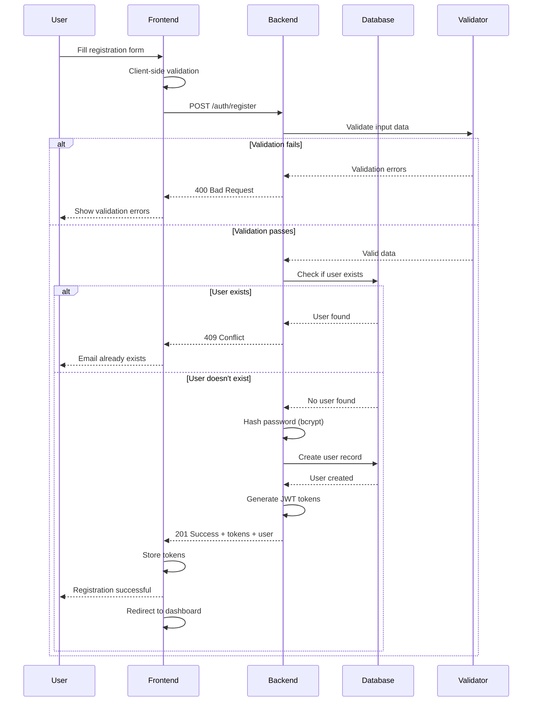

## User Login Flow

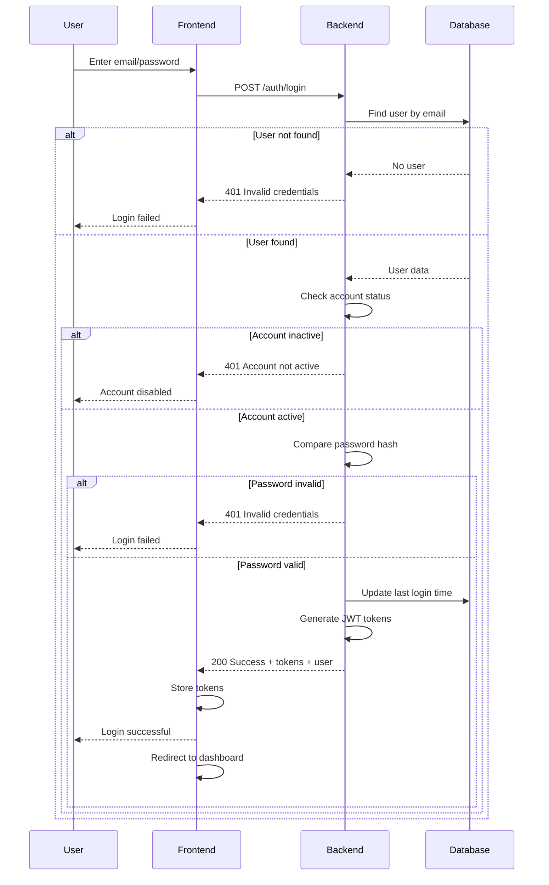

## Token Refresh Flow

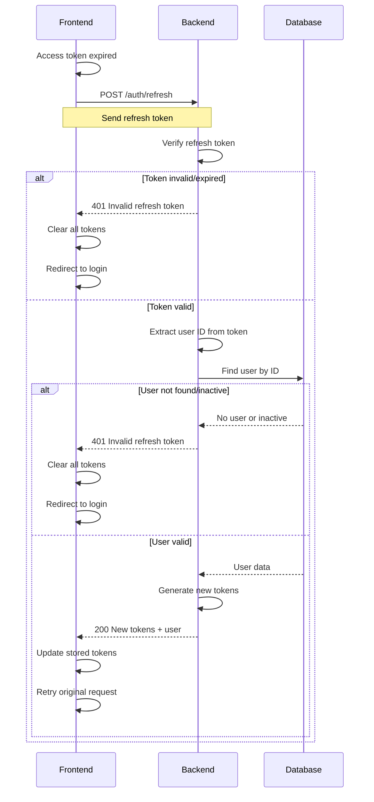

## Protected Route Access

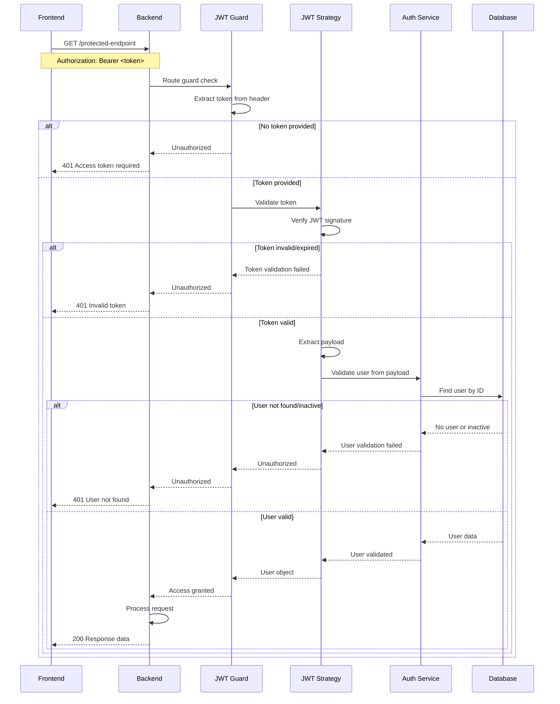

## Logout Flow

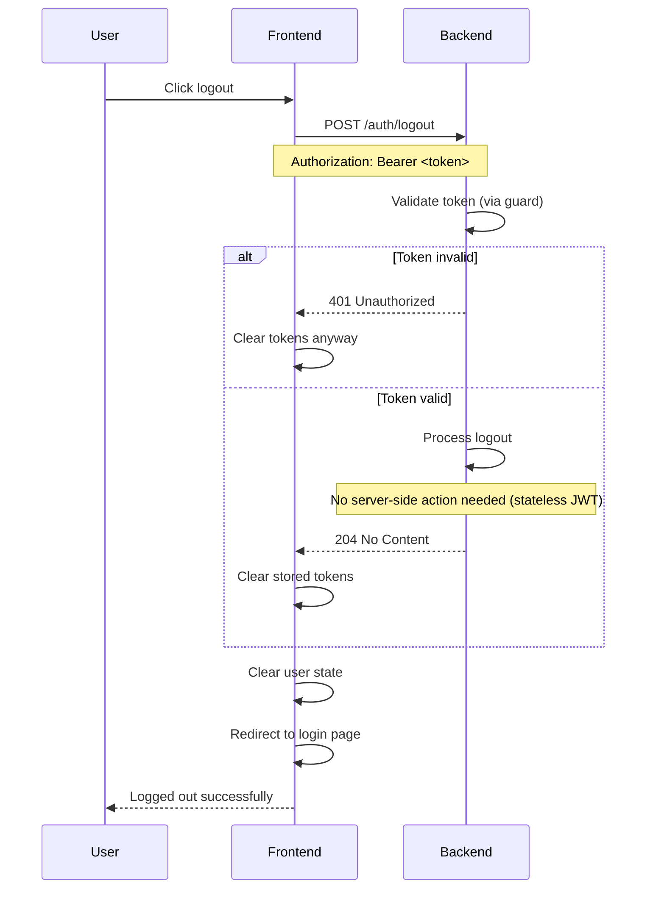

## Error Handling Flows

### Password Validation Error Flow

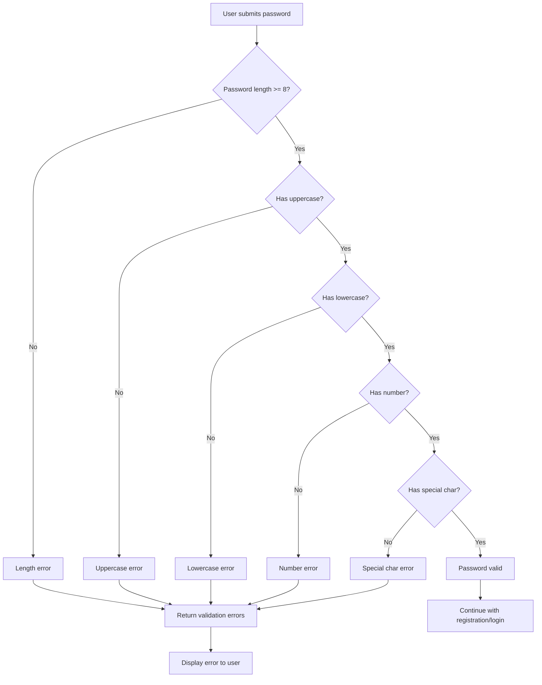

### JWT Token Validation Error Flow

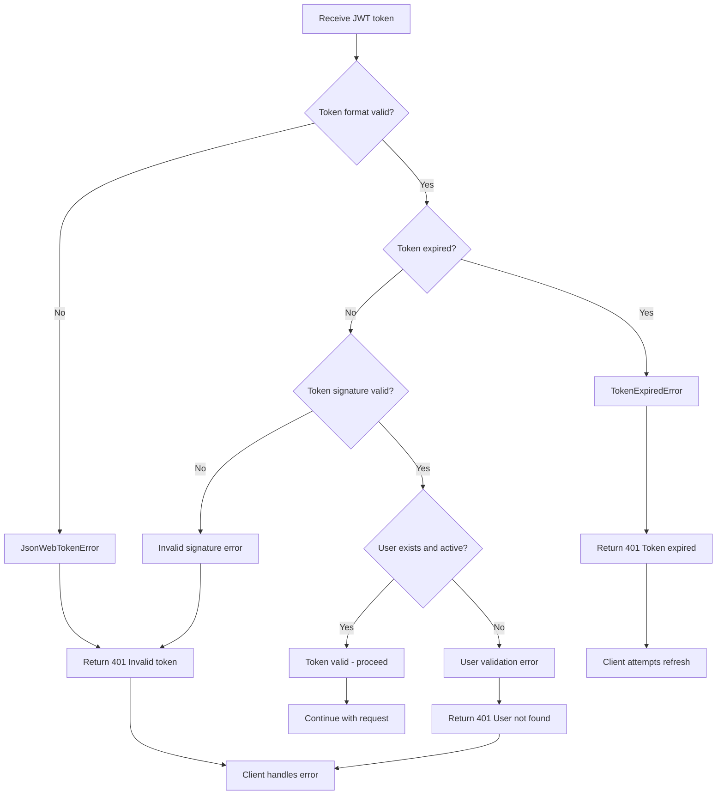

## Security Validation Flow

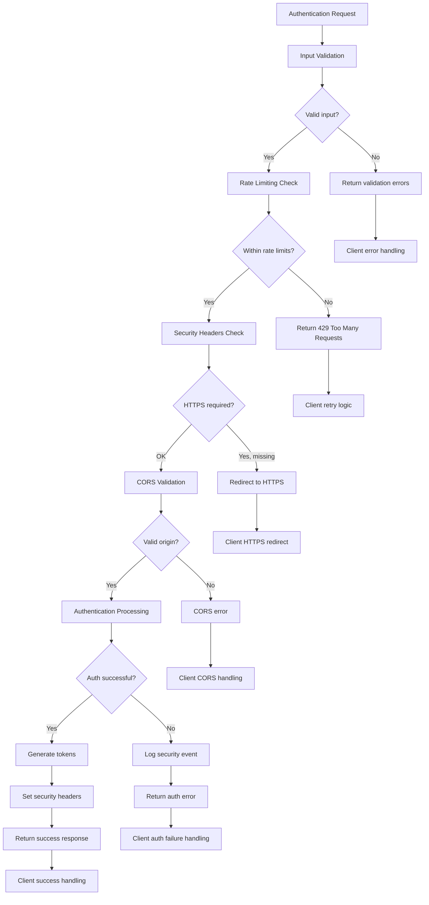

## Token Lifecycle Flow

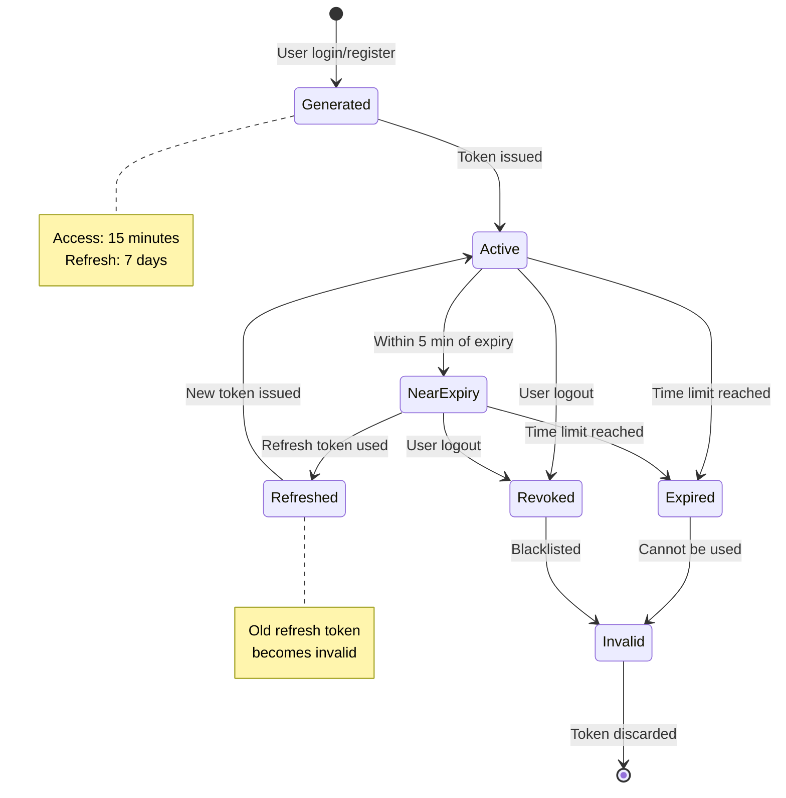

## Frontend Authentication State Flow

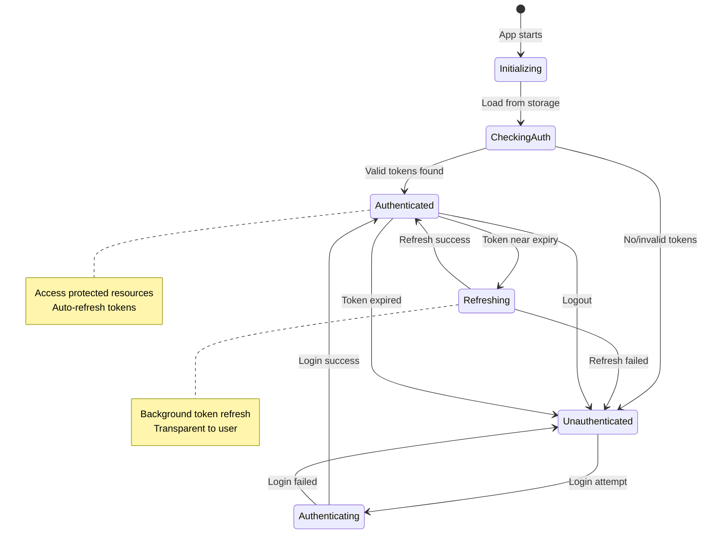

## Database Security Flow

```mermaid
flowchart TD
    A[User credentials] --> B[Input sanitization]
    B --> C[Email normalization]
    C --> D{User registration?}
    D -->|Yes| E[Password complexity check]
    D -->|No| F[User lookup by email]
    E --> G[Generate salt]
    G --> H[Hash password with bcrypt]
    H --> I[Store user record]
    I --> J[Generate JWT tokens]

    F --> K{User exists?}
    K -->|No| L[Return auth error]
    K -->|Yes| M[Check account status]
    M --> N{Account active?}
    N -->|No| O[Return account inactive]
    N -->|Yes| P[Verify password hash]
    P --> Q{Password valid?}
    Q -->|No| R[Log failed attempt]
    Q -->|Yes| S[Update last login]

    R --> L
    S --> J
    J --> T[Return tokens to client]

    style G fill:#e1f5fe
    style H fill:#e1f5fe
    style P fill:#e1f5fe
    note bottom of H : bcrypt with 12 salt rounds
    note bottom of P : bcrypt.compare()
```

## API Authentication Middleware Flow

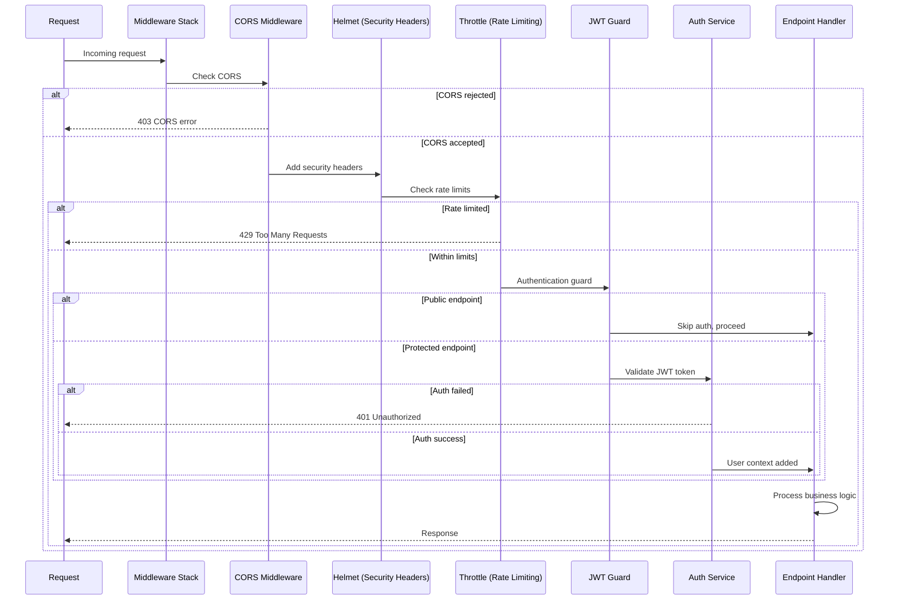

---

These diagrams provide a comprehensive visual guide to understanding how authentication works in the MoneyWise system. They can be used for:

- Developer onboarding and training
- System architecture documentation
- Debugging authentication issues
- Security audits and reviews
- Frontend integration planning

All diagrams are created using Mermaid syntax and can be rendered in most modern documentation systems, including GitHub, GitLab, and popular documentation platforms.