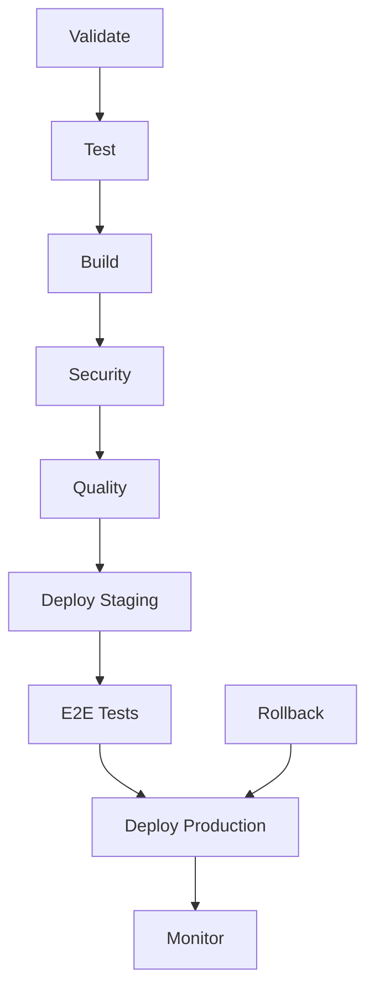

# MoneyWise CI/CD Architecture

> **Maintained by**: Senior Tester Architect & CI/CD Engineer **Version**: 1.0.0 **Last Updated**: 2025-01-19

## 🏗️ Architecture Overview

The MoneyWise CI/CD pipeline is designed for **reliability**, **speed**, and **quality assurance**. It implements a
comprehensive testing strategy following industry best practices and ensures continuous delivery with zero-downtime
deployments.

### 🎯 Design Principles

1. **Fail Fast**: Catch issues early in the pipeline
2. **Parallel Execution**: Maximize efficiency with concurrent jobs
3. **Quality Gates**: Enforce quality standards at every stage
4. **Security First**: Integrated security scanning throughout
5. **Observability**: Comprehensive monitoring and alerting

## 📋 Pipeline Stages



### 1. **Validate Stage** (2-3 minutes)

**Purpose**: Early validation of code quality and dependencies

**Jobs**:

- `validate:dependencies` - Security audit and dependency check
- `validate:lint` - Code style and linting validation
- `validate:types` - TypeScript type checking

**Quality Gates**:

- ✅ No high-severity vulnerabilities
- ✅ Linting passes with zero errors
- ✅ No TypeScript errors

### 2. **Test Stage** (5-8 minutes)

**Purpose**: Comprehensive testing across all layers

**Jobs**:

- `test:unit:frontend` - Frontend unit tests with coverage
- `test:unit:backend` - Backend unit tests with coverage
- `test:integration:frontend` - Frontend integration tests
- `test:integration:backend` - Backend integration tests
- `test:accessibility` - WCAG 2.1 AA compliance tests

**Quality Gates**:

- ✅ Minimum 80% code coverage
- ✅ All tests pass
- ✅ Zero accessibility violations

**Coverage Requirements**:

```yaml
Coverage Thresholds:
  Lines: 80%
  Functions: 80%
  Branches: 80%
  Statements: 80%
```

### 3. **Build Stage** (3-5 minutes)

**Purpose**: Create optimized Docker images for deployment

**Jobs**:

- `build:docker:frontend` - Multi-stage frontend build
- `build:docker:backend` - Multi-stage backend build

**Optimizations**:

- Layer caching with GitLab Container Registry
- Multi-stage builds for smaller production images
- Parallel building for faster execution

### 4. **Security Stage** (2-4 minutes)

**Purpose**: Comprehensive security scanning

**Jobs**:

- `sast` - Static Application Security Testing
- `secret_detection` - Credential leak detection
- `dependency_scanning` - Vulnerability scanning
- `container_scanning` - Docker image security

**Security Standards**:

- ❌ Zero critical vulnerabilities
- ⚠️ Limited high-severity vulnerabilities (with justification)
- 🔍 All secrets properly managed

### 5. **Quality Stage** (1-2 minutes)

**Purpose**: Enforce quality standards and generate reports

**Jobs**:

- `quality:coverage-check` - Validate coverage thresholds
- SonarQube integration (optional)

### 6. **Deploy Staging** (3-5 minutes)

**Purpose**: Deploy to staging environment for integration testing

**Features**:

- Blue-green deployment strategy
- Health checks before traffic switch
- Automatic rollback on failure

### 7. **E2E Tests** (10-15 minutes)

**Purpose**: End-to-end validation in staging environment

**Jobs**:

- `test:e2e:staging` - Complete user journey tests
- `test:performance:staging` - Core Web Vitals validation

**Test Coverage**:

- 🎭 Critical user journeys
- ⚡ Performance budgets
- ♿ Accessibility compliance
- 📱 Responsive design

### 8. **Deploy Production** (5-10 minutes)

**Purpose**: Zero-downtime production deployment

**Strategy**: Blue-Green Deployment

- Deploy to inactive environment
- Run health checks
- Switch traffic atomically
- Keep previous version for instant rollback

**Manual Approval**: Required for production deployments

### 9. **Monitor** (Continuous)

**Purpose**: Post-deployment monitoring and alerting

**Metrics**:

- Application health and performance
- Error rates and response times
- User experience metrics
- Infrastructure utilization

## 🔧 Configuration Files

### Core Configuration

| File                       | Purpose                     | Owner          |
| -------------------------- | --------------------------- | -------------- |
| `.gitlab-ci.yml`           | Main pipeline configuration | CI/CD Engineer |
| `docker-compose.ci.yml`    | Testing environment setup   | CI/CD Engineer |
| `sonar-project.properties` | Code quality configuration  | Senior Tester  |
| `budget.json`              | Performance budget          | Senior Tester  |

### Docker Configuration

| File              | Purpose                 | Environment |
| ----------------- | ----------------------- | ----------- |
| `Dockerfile`      | Production builds       | Production  |
| `Dockerfile.dev`  | Development environment | Development |
| `Dockerfile.test` | Testing environment     | CI/CD       |
| `.dockerignore`   | Build optimization      | All         |

### Testing Configuration

| File                           | Purpose                 | Framework  |
| ------------------------------ | ----------------------- | ---------- |
| `jest.config.js`               | Unit test configuration | Jest       |
| `playwright.config.ts`         | E2E test configuration  | Playwright |
| `playwright.config.staging.ts` | Staging E2E tests       | Playwright |

## 🚀 Deployment Strategies

### Staging Deployment

**Environment**: `staging` **URL**: `https://staging-money-wise.example.com` **Strategy**: Direct deployment with health
checks

```yaml
Staging Characteristics:
  - Automatic deployment on main branch
  - Full production data simulation
  - Performance testing environment
  - Client review and approval
```

### Production Deployment

**Environment**: `production` **URL**: `https://money-wise.example.com` **Strategy**: Blue-Green deployment with manual
approval

```yaml
Production Characteristics:
  - Manual approval required
  - Blue-green deployment
  - Automatic health checks
  - Instant rollback capability
  - Zero-downtime updates
```

### Rollback Procedure

**Automatic Rollback Triggers**:

- Health check failures
- Error rate spikes (>5%)
- Performance degradation (>20%)

**Manual Rollback**:

```bash
# Available as manual job in GitLab CI
Job: rollback:production
Trigger: Manual button in pipeline
Notification: Automatic Slack alert
```

## 📊 Monitoring & Observability

### Health Checks

**Application Health**:

```yaml
Endpoints:
  - /health (basic health)
  - /health/detailed (database, cache, external services)
  - /metrics (Prometheus metrics)

Success Criteria:
  - HTTP 200 response
  - Response time < 500ms
  - All dependencies healthy
```

### Performance Monitoring

**Core Web Vitals**:

- First Contentful Paint (FCP) < 2s
- Largest Contentful Paint (LCP) < 2.5s
- First Input Delay (FID) < 100ms
- Cumulative Layout Shift (CLS) < 0.1

### Error Tracking

**Integration**: Sentry (recommended)

- Real-time error monitoring
- Performance tracking
- Release tracking
- User impact analysis

## 🔔 Notification System

### Slack Integration

**Channels**:

- `#moneywise-ci` - Pipeline notifications
- `#moneywise-alerts` - Production alerts
- `#moneywise-deployments` - Deployment announcements

**Notification Types**:

- ✅ Pipeline success
- ❌ Pipeline failures
- 🚀 Deployments
- 🔄 Rollbacks
- ⚠️ Quality gate violations

### Email Notifications

**Recipients**:

- Development team (failures)
- Product team (deployments)
- Management (critical issues)

## 🔐 Security & Compliance

### Secret Management

**GitLab CI/CD Variables**:

```yaml
Protected Variables:
  - SLACK_WEBHOOK_URL
  - SONAR_TOKEN
  - PRODUCTION_DEPLOY_KEY
  - DATABASE_PASSWORDS

Masked Variables:
  - JWT_SECRETS
  - API_TOKENS
  - WEBHOOK_URLS
```

### Access Control

**Deployment Permissions**:

- Staging: All developers
- Production: Senior developers + approvers
- Rollback: On-call engineer + team leads

### Compliance

**Standards**:

- WCAG 2.1 AA accessibility
- GDPR data protection
- SOC 2 security controls
- PCI DSS (if payment processing)

## 📈 Performance Metrics

### Pipeline Performance

**Target Metrics**:

- Total pipeline time: < 25 minutes
- Time to staging: < 15 minutes
- Time to production: < 35 minutes (including approval)
- Success rate: > 95%

### Quality Metrics

**Code Quality**:

- Coverage: > 80%
- Duplication: < 3%
- Maintainability rating: A
- Security rating: A

**Performance**:

- Core Web Vitals: All green
- Lighthouse score: > 90
- Bundle size: < 2MB total
- API response time: < 200ms p95

## 🛠️ Troubleshooting

### Common Issues

**Pipeline Failures**:

1. **Dependency issues**: Clear cache, update lockfiles
2. **Test failures**: Check test isolation, mock external services
3. **Build failures**: Verify Docker configuration, resource limits
4. **Deployment failures**: Check health endpoints, resource availability

**Performance Issues**:

1. **Slow builds**: Optimize Docker layers, use build cache
2. **Slow tests**: Parallelize execution, optimize test data
3. **Long deployments**: Improve health check efficiency

### Emergency Procedures

**Production Incident**:

1. Immediate rollback (if recent deployment)
2. Disable CI/CD pipeline
3. Notify stakeholders
4. Investigate and fix
5. Deploy hotfix
6. Post-incident review

## 📚 Additional Resources

### Documentation Links

- [Testing Strategy](./TESTING_STRATEGY.md)
- [Docker Best Practices](./DOCKER_BEST_PRACTICES.md)
- [Security Guidelines](./SECURITY_GUIDELINES.md)
- [Monitoring Setup](./MONITORING_SETUP.md)

### External Tools

- [GitLab CI/CD Documentation](https://docs.gitlab.com/ee/ci/)
- [Playwright Documentation](https://playwright.dev/)
- [SonarQube Documentation](https://docs.sonarqube.org/)
- [Docker Best Practices](https://docs.docker.com/develop/dev-best-practices/)

---

**Contact**: Senior Tester Architect & CI/CD Engineer **Support**: `#moneywise-ci` on Slack **Emergency**: On-call
rotation via PagerDuty
