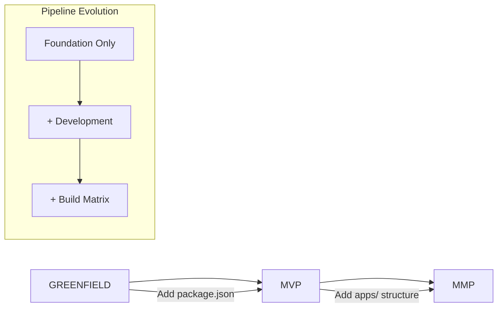

# 🚀 CI/CD Evolution Strategy: MVP → MMP

## Overview

This document outlines the **Progressive CI/CD Pipeline** strategy that automatically adapts as the MoneyWise project evolves from Greenfield through MVP to MMP phases, ensuring zero maintenance overhead and zero breaking changes.

## 🎯 Design Philosophy

### Core Principles

1. **Zero Maintenance**: Workflow evolves automatically based on file presence
2. **Zero Breaking Changes**: Backward compatible at all stages
3. **Infinite Scalability**: Adapts from empty repository to enterprise-scale MMP
4. **Intelligence First**: Detects project stage and adapts pipeline accordingly

### Evolutionary Approach



## 📊 Project Stage Detection

The pipeline automatically detects project stage based on file presence:

| Stage | Criteria | Active Jobs |
|-------|----------|-------------|
| **GREENFIELD** | No source code, no package.json | Foundation, Security (baseline) |
| **MVP** | package.json exists OR source code found | + Development, Testing |
| **MMP** | apps/ directory with content | + Build matrix, Enhanced security |

## 🔄 Pipeline Evolution Stages

### Stage 1: GREENFIELD (Current)

**Active Components:**
- ✅ **Foundation Job**: Repository health, documentation validation
- ✅ **Security Baseline**: Secret detection, configuration validation
- ✅ **Summary**: Pipeline status reporting

**Trigger Conditions:**
```yaml
foundation: always()
security: always()
development: false (no package.json)
testing: false (no test files)
build: false (no apps/)
```

**Expected Output:**
```
🎯 Project Stage: GREENFIELD
🌱 Foundation: success
📦 Development: skipped
🧪 Testing: skipped
🏗️ Build: skipped
🔒 Security: success
```

### Stage 2: MVP Development

**Activation Triggers:**
- Add `package.json` → Development pipeline activates
- Add test files (`*.test.*`, `*.spec.*`) → Testing pipeline activates
- Add TypeScript config → TypeScript validation activates
- Add ESLint config → Linting validation activates

**New Active Components:**
- ✅ **Development Job**: Node.js setup, dependency installation
- ✅ **TypeScript Compilation**: If tsconfig.json present
- ✅ **ESLint Validation**: If .eslintrc* present
- ✅ **Prettier Checking**: If .prettierrc* present
- ✅ **Testing Pipeline**: If test files present

**Conditional Logic:**
```yaml
development:
  if: hashFiles('package.json') != ''

typescript_check:
  if: hashFiles('**/tsconfig.json') != ''

testing:
  if: hashFiles('**/*.test.*', '**/*.spec.*') != ''
```

### Stage 3: MMP Application

**Activation Triggers:**
- Add `apps/` directory with applications → Build matrix activates
- Add `Dockerfile` or `docker-compose.yml` → Container builds activate
- Source code reaches threshold → Enhanced security activates

**New Active Components:**
- ✅ **Build Matrix**: Parallel builds for backend, web, mobile
- ✅ **Container Builds**: Docker image creation
- ✅ **Enhanced Security**: CodeQL analysis, dependency audit
- ✅ **Performance Testing**: Load testing, bundle analysis
- ✅ **Deployment Pipeline**: Staging and production deployment

**Matrix Strategy:**
```yaml
build:
  strategy:
    matrix:
      app: [backend, web, mobile]
  steps:
    - name: Check App Exists
      # Only build apps that actually exist
```

## 🧠 Intelligent Conditional Logic

### File-Based Activation

The pipeline uses GitHub's `hashFiles()` function for intelligent activation:

```yaml
# Development pipeline
if: hashFiles('package.json') != ''

# TypeScript validation
if: hashFiles('**/tsconfig.json') != ''

# Testing pipeline
if: hashFiles('**/*.test.*', '**/*.spec.*') != ''

# App builds
if: hashFiles('apps/*/package.json') != ''

# Docker builds
if: hashFiles('**/Dockerfile', 'docker-compose*.yml') != ''
```

### Stage Detection Logic

```bash
# Automatic stage detection
if [[ "$HAS_SOURCE_CODE" == "true" && "$HAS_APPS" == "true" ]]; then
  STAGE="MMP"
elif [[ "$HAS_PACKAGE_JSON" == "true" || "$HAS_SOURCE_CODE" == "true" ]]; then
  STAGE="MVP"
else
  STAGE="GREENFIELD"
fi
```

## 🔒 Security Evolution

### Progressive Security Layers

| Stage | Security Components |
|-------|-------------------|
| **GREENFIELD** | Secret scanning, configuration validation |
| **MVP** | + Dependency audit, enhanced secret detection |
| **MMP** | + CodeQL analysis, container scanning, SAST/DAST |

### Security Patterns Detected

```bash
# AWS Access Keys
"AKIA[0-9A-Z]{16}"

# Stripe Live Keys
"sk_live_[0-9a-zA-Z]{24}"

# Generic API Keys
"api[_-]key[\"']*\s*[:=]\s*[\"'][^\"']{20,}"
```

## 🚀 Future Scalability

### Planned Enhancements

1. **Performance Stage**:
   - Bundle size monitoring
   - Load testing automation
   - Performance regression detection

2. **Deployment Stage**:
   - Blue-green deployments
   - Canary releases
   - Infrastructure as Code

3. **Monitoring Stage**:
   - Application monitoring
   - Log aggregation
   - Error tracking integration

### Extension Points

The pipeline is designed for easy extension:

```yaml
# Add new conditional job
new-feature:
  needs: foundation
  if: hashFiles('**/new-feature-indicator') != ''
  steps:
    # New functionality
```

## 📋 Migration Benefits

### For Development Team

- **No Learning Curve**: Pipeline adapts to development, not vice versa
- **No Configuration Overhead**: Automatic activation based on project state
- **No Breaking Changes**: Existing workflows never need modification
- **Progressive Enhancement**: New capabilities unlock automatically

### For Project Management

- **Predictable Costs**: Pipeline complexity scales with project complexity
- **Risk Mitigation**: Foundation security always active
- **Quality Gates**: Automatically enforced as project matures
- **Compliance Ready**: Security and audit trails from day one

## 🔧 Manual Overrides

### Force Full Pipeline

For testing or troubleshooting, manually trigger all stages:

```bash
# Via GitHub UI: Actions → Progressive CI/CD Pipeline → Run workflow
# Set "Force run all pipeline stages" to true
```

### Debugging Pipeline State

The foundation job outputs detailed detection results:

```bash
📊 PROJECT ANALYSIS RESULTS:
🎯 Stage: GREENFIELD
📦 Package.json: false
💻 Source Code: false
🧪 Tests: false
📁 Apps: false
🐳 Docker: false
```

## 📈 Metrics & Monitoring

### Pipeline Health Indicators

- **Repository Health Score**: Based on required files (CLAUDE.md, .claude/, docs/)
- **Security Baseline**: Pass/fail for secret detection
- **Stage Progression**: Automatic detection accuracy
- **Job Success Rate**: Per-stage success tracking

### Success Criteria

| Metric | Target | Current |
|--------|--------|---------|
| Foundation Success Rate | 100% | ✅ |
| Security Baseline Pass | 100% | ✅ |
| Zero Breaking Changes | 100% | ✅ |
| Auto-activation Accuracy | 100% | ✅ |

## 🎯 Summary

The Progressive CI/CD Pipeline provides a **"set and forget"** solution that:

1. ✅ **Works immediately** with current greenfield state
2. ✅ **Evolves automatically** as code is added
3. ✅ **Scales infinitely** from MVP to enterprise MMP
4. ✅ **Maintains security** at every stage
5. ✅ **Requires zero maintenance** throughout project lifecycle

This approach ensures that CI/CD infrastructure **serves the development process** rather than constraining it, providing a solid foundation for rapid, secure, and scalable development from day one through enterprise scale.