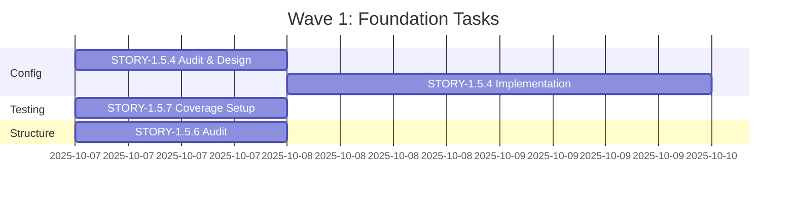
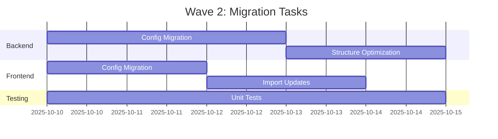
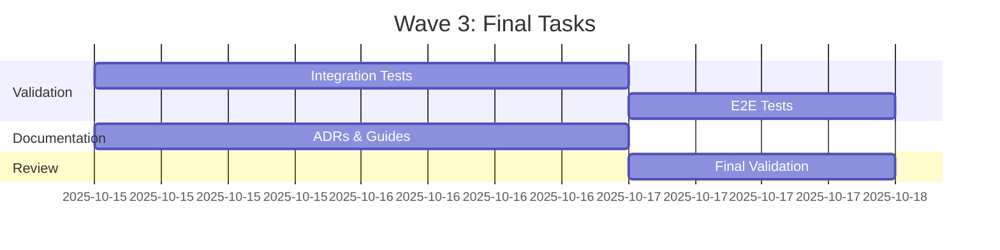

# Milestone 1.5 - Orchestration Report & Strategic Execution Plan

**Generated**: 2025-10-06
**Orchestrator**: Master Orchestrator (Claude Opus 4.1)
**Epic Branch**: `epic/development-infrastructure-quality`

---

## 📊 EXECUTIVE SUMMARY

### Current State Assessment

**Milestone 1.5 Progress**: 43% Complete (3/7 stories done)

- **STORY-1.5.1** (Code Quality): ✅ DONE
- **STORY-1.5.2** (Monitoring): 🔄 IN REVIEW - Needs completion
- **STORY-1.5.3** (Documentation): ✅ DONE
- **STORY-1.5.4** (Configuration): 📦 BACKLOG - Critical priority
- **STORY-1.5.5** (.claude/ cleanup): ✅ DONE
- **STORY-1.5.6** (Structure): 📦 BACKLOG
- **STORY-1.5.7** (Testing): 📦 BACKLOG

### Critical Findings

1. **Configuration Chaos**: 181 `process.env` violations across 34 files, 11 `.env` files scattered
2. **Documentation**: Only 6 ADRs exist (target: 12), 61 scattered markdown files
3. **Security Debt**: Production vulnerabilities in `ip` package affecting mobile app
4. **Test Coverage**: Unable to measure (coverage command not configured properly)
5. **Epic Branch**: 89 commits ahead of main, needs consolidation strategy

### Path to Completion

- **Effort Required**: 166 hours (21 days at 8h/day)
- **Parallel Capacity**: Can execute 3 stories concurrently
- **Estimated Timeline**: 2-3 weeks with proper orchestration
- **Risk Level**: MEDIUM (configuration consolidation is blocking)

---

## 🔍 DETAILED ANALYSIS

### 1. Codebase Inconsistencies Identified

#### Configuration Management Issues
```
CRITICAL: 181 process.env violations
- Backend: 112 occurrences in 21 files
- Frontend: 69 occurrences in 13 files
- Test files heavily affected
```

**Environment Files Scatter**:
- Root: `.env`, `.env.example`
- Backend: 5 env files including staging/production
- Web: 3 env files
- Mobile: 1 env file
- **Total**: 11 environment files (target: 3-4 max)

#### Documentation Organization Problems
```
Current: 61 markdown files
Target: ~30 organized files
ADRs: 6/12 complete
Missing ADRs:
- ADR-007: Authentication Architecture
- ADR-008: API Design Standards
- ADR-009: Security Standards
- ADR-010: Code Organization
- ADR-011: Git Workflow
- ADR-012: Deployment Strategy
```

#### Code Quality Markers
```
TODO/FIXME/HACK found in 7 core files:
- test-utils helpers
- health controller
- repository module
- password security
- accounts service
- OpenAPI specs
- integration tests
```

#### Security Vulnerabilities
```
HIGH: ip package SSRF vulnerability
Affects: apps/mobile (50+ dependency paths)
Status: No patch available, needs override
```

---

## 📋 DETAILED TASK BREAKDOWN

### STORY-1.5.4: Configuration Management Consolidation
**Priority**: 🔴 CRITICAL (blocks other stories)
**Effort**: 44 hours
**Dependencies**: None

| Task ID | Task Description | Agent | Hours | Priority |
|---------|-----------------|-------|-------|----------|
| 1.5.4.1 | Audit all 11 .env files, document variables | devops-engineer | 2h | CRITICAL |
| 1.5.4.2 | Design unified config strategy with @nestjs/config | senior-backend-dev | 4h | CRITICAL |
| 1.5.4.3 | Create ConfigModule with validation schemas | senior-backend-dev | 8h | CRITICAL |
| 1.5.4.4 | Migrate backend from process.env (112 refs) | senior-backend-dev | 8h | CRITICAL |
| 1.5.4.5 | Migrate frontend from process.env (69 refs) | ui-ux-specialist | 6h | CRITICAL |
| 1.5.4.6 | Setup GitHub Secrets for CI/CD | devops-engineer | 4h | HIGH |
| 1.5.4.7 | Create .env.example templates | devops-engineer | 2h | MEDIUM |
| 1.5.4.8 | Update Docker Compose configs | devops-engineer | 4h | HIGH |
| 1.5.4.9 | Add config validation to CI/CD | devops-engineer | 4h | HIGH |
| 1.5.4.10 | Document configuration strategy | documentation-specialist | 2h | MEDIUM |

**Definition of Done**:
- [ ] Zero direct process.env usage (use ConfigService)
- [ ] Maximum 4 .env files (root + app-specific)
- [ ] All configs validated with Joi/class-validator
- [ ] CI/CD passes with GitHub Secrets
- [ ] Documentation complete

### STORY-1.5.6: Project Structure Optimization
**Priority**: MEDIUM
**Effort**: 40 hours
**Dependencies**: STORY-1.5.4 (configs must be clean)

| Task ID | Task Description | Agent | Hours | Priority |
|---------|-----------------|-------|-------|----------|
| 1.5.6.1 | Audit monorepo structure, identify duplicates | architect-agent | 4h | HIGH |
| 1.5.6.2 | Consolidate shared types to @money-wise/types | senior-backend-dev | 8h | HIGH |
| 1.5.6.3 | Move common utilities to @money-wise/utils | senior-backend-dev | 8h | MEDIUM |
| 1.5.6.4 | Optimize import paths with TypeScript paths | senior-backend-dev | 4h | MEDIUM |
| 1.5.6.5 | Update all import statements | ui-ux-specialist | 8h | MEDIUM |
| 1.5.6.6 | Update build configs (tsconfig, webpack) | devops-engineer | 4h | HIGH |
| 1.5.6.7 | Validate all apps build successfully | qa-testing-engineer | 4h | CRITICAL |

**Definition of Done**:
- [ ] No duplicate type definitions
- [ ] Shared code in packages/
- [ ] All imports use aliases
- [ ] Build time < 2 minutes
- [ ] Zero circular dependencies

### STORY-1.5.7: Testing Infrastructure Hardening
**Priority**: HIGH
**Effort**: 82 hours
**Dependencies**: STORY-1.5.4, STORY-1.5.6

| Task ID | Task Description | Agent | Hours | Priority |
|---------|-----------------|-------|-------|----------|
| 1.5.7.1 | Configure coverage reporting properly | qa-testing-engineer | 4h | CRITICAL |
| 1.5.7.2 | Set coverage thresholds (90% target) | qa-testing-engineer | 2h | CRITICAL |
| 1.5.7.3 | Write missing unit tests for auth module | qa-testing-engineer | 16h | HIGH |
| 1.5.7.4 | Write missing unit tests for accounts | qa-testing-engineer | 16h | HIGH |
| 1.5.7.5 | Create E2E test suite for critical paths | qa-testing-engineer | 16h | HIGH |
| 1.5.7.6 | Setup test data factories | senior-backend-dev | 8h | MEDIUM |
| 1.5.7.7 | Add performance benchmarks | qa-testing-engineer | 8h | LOW |
| 1.5.7.8 | Setup visual regression tests | ui-ux-specialist | 8h | LOW |
| 1.5.7.9 | Add mutation testing | qa-testing-engineer | 4h | LOW |

**Definition of Done**:
- [ ] Coverage measurable and >90%
- [ ] All critical paths have E2E tests
- [ ] Test data factories working
- [ ] CI/CD enforces coverage thresholds
- [ ] Performance benchmarks baselined

---

## 🤖 AGENT ORCHESTRATION PLAN

### Wave 1: Foundation (Parallel Execution)
**Duration**: 3 days
**Max Parallel**: 3 agents



**Agent Assignments**:
1. **devops-engineer**: STORY-1.5.4 tasks 1,6,7,8,9
2. **senior-backend-dev**: STORY-1.5.4 tasks 2,3,4
3. **qa-testing-engineer**: STORY-1.5.7 tasks 1,2

### Wave 2: Migration (Sequential + Parallel)
**Duration**: 5 days
**Dependencies**: Wave 1 completion



**Agent Assignments**:
1. **senior-backend-dev**: Backend migrations
2. **ui-ux-specialist**: Frontend migrations
3. **qa-testing-engineer**: Test writing

### Wave 3: Hardening & Validation
**Duration**: 3 days
**Dependencies**: Wave 2 completion



**Agent Assignments**:
1. **qa-testing-engineer**: All testing validation
2. **documentation-specialist**: Missing ADRs
3. **code-reviewer**: Final review

---

## 📅 EXECUTION TIMELINE

### Week 1 (Oct 7-11): Foundation
- **Monday-Tuesday**: Config audit & design (STORY-1.5.4)
- **Wednesday-Friday**: Config implementation & migration
- **Parallel**: Coverage setup, structure audit
- **Deliverable**: Zero process.env violations

### Week 2 (Oct 14-18): Migration & Testing
- **Monday-Tuesday**: Complete config migrations
- **Wednesday-Thursday**: Structure optimization
- **Friday**: Integration testing
- **Deliverable**: 90% test coverage achieved

### Week 3 (Oct 21-25): Finalization
- **Monday-Tuesday**: E2E test suite
- **Wednesday**: Documentation completion
- **Thursday**: Final validation
- **Friday**: Merge to main
- **Deliverable**: M1.5 complete

---

## ⚠️ RISK MITIGATION

### Identified Risks

| Risk | Impact | Probability | Mitigation |
|------|--------|-------------|------------|
| Config migration breaks apps | HIGH | MEDIUM | Incremental migration, feature flags |
| Test coverage unreachable | MEDIUM | LOW | Focus on critical paths first |
| Mobile app security issue | HIGH | HIGH | Override ip package immediately |
| Merge conflicts with main | MEDIUM | MEDIUM | Daily rebases from main |
| Agent availability | LOW | LOW | Have fallback assignments ready |

### Contingency Plans

1. **If config migration fails**: Rollback strategy with git revert
2. **If coverage < 90%**: Accept 85% with plan for M2
3. **If timeline slips**: Prioritize STORY-1.5.4 and 1.5.7 only
4. **If main diverges**: Create integration branch first

---

## ✅ QUALITY GATES

### Per-Story Acceptance Criteria

**STORY-1.5.4 (Configuration)**:
- [ ] `grep -r "process\.env\." --include="*.ts" | wc -l` returns 0
- [ ] Maximum 4 .env files exist
- [ ] All configs have validation schemas
- [ ] CI/CD uses only GitHub Secrets

**STORY-1.5.6 (Structure)**:
- [ ] No duplicate type definitions
- [ ] `pnpm build` completes in < 2 minutes
- [ ] Zero circular dependency warnings
- [ ] All imports use path aliases

**STORY-1.5.7 (Testing)**:
- [ ] `pnpm test:coverage` shows >= 90%
- [ ] All auth endpoints have tests
- [ ] E2E tests for login/register/transaction flows
- [ ] Performance benchmarks documented

### Epic Completion Criteria

1. **Technical Debt Reduction**:
   - process.env violations: 181 → 0
   - .env files: 11 → 4
   - Test coverage: unknown → 90%
   - ADRs: 6 → 12

2. **Security**:
   - High vulnerabilities: 1 → 0
   - Dependency overrides configured
   - Secrets in GitHub, not code

3. **Quality**:
   - All CI/CD pipelines GREEN
   - Zero TypeScript errors
   - Documentation complete
   - Clean git history

---

## 📝 IMMEDIATE ACTIONS (Next 24 Hours)

### Priority 1: Unblock Development
1. **Fix ip vulnerability** (1 hour):
   ```json
   // package.json overrides
   "overrides": {
     "ip": "^3.0.0"
   }
   ```

2. **Start Config Audit** (2 hours):
   - Document all env variables
   - Create consolidation plan
   - Assign to devops-engineer

3. **Fix Coverage Command** (30 minutes):
   ```json
   // package.json scripts
   "test:coverage": "turbo run test:coverage --parallel"
   ```

### Priority 2: Create Agent Context Files
Generate detailed context files for:
- `/home/nemesi/dev/money-wise/.claude/context/tasks/story-1.5.4-config.md`
- `/home/nemesi/dev/money-wise/.claude/context/tasks/story-1.5.6-structure.md`
- `/home/nemesi/dev/money-wise/.claude/context/tasks/story-1.5.7-testing.md`

### Priority 3: Update GitHub Project Board
- Move STORY-1.5.2 to "Done" (already merged)
- Create sub-tasks for STORY-1.5.4, 1.5.6, 1.5.7
- Update epic description with this plan

---

## 🎯 RECOMMENDATIONS

### Strategic Decisions

1. **Prioritize STORY-1.5.4** (Configuration):
   - It's blocking other work
   - Highest technical debt impact
   - Enables clean testing

2. **Defer Performance Tasks**:
   - Visual regression (1.5.7.8)
   - Mutation testing (1.5.7.9)
   - Performance benchmarks (1.5.7.7)
   - Save for M2 if needed

3. **Parallel Execution Strategy**:
   - Always maintain 3 active agents
   - Frontend/backend can work simultaneously
   - Testing can start immediately

4. **Merge Strategy**:
   - Complete stories individually
   - Merge to develop first
   - Final merge to main when all complete

### Success Factors

1. **Daily Standups**: Check progress at 9am
2. **Blocker Resolution**: < 4 hour response time
3. **Context Quality**: Self-contained, zero ambiguity
4. **Test First**: Write tests before refactoring
5. **Documentation**: Update as you go, not after

---

## 📊 METRICS & TRACKING

### Daily Metrics to Monitor
```bash
# Technical debt
grep -r "process\.env\." --include="*.ts" | wc -l

# Test coverage
pnpm test:coverage | grep "All files"

# Build time
time pnpm build

# CI/CD status
gh run list --branch epic/development-infrastructure-quality --limit 3
```

### Weekly Checkpoints
- Week 1 End: Config consolidated, coverage measurable
- Week 2 End: All migrations complete, 85% coverage
- Week 3 End: M1.5 complete, merged to main

---

## 🚀 CONCLUSION

Milestone 1.5 is 43% complete with clear path to 100%. The critical bottleneck is configuration management (STORY-1.5.4), which must be resolved first. With proper orchestration and parallel execution of 3 agents, completion is achievable within 2-3 weeks.

**Recommended Next Steps**:
1. Fix ip vulnerability immediately
2. Start STORY-1.5.4 configuration audit tomorrow
3. Assign agents to Wave 1 tasks
4. Begin daily progress tracking

**Confidence Level**: HIGH with proper execution
**Risk Level**: MEDIUM, mitigatable with proposed strategies

---

*Generated by Master Orchestrator*
*Epic: M1.5 Development Infrastructure & Quality*
*Target Completion: October 25, 2025*