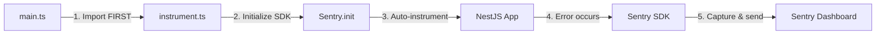

# Sentry Error Tracking - Runbook

**Last Updated**: 2025-10-04
**Version**: 1.0.0
**Status**: Active

## 📋 Overview

This runbook provides operational guidance for MoneyWise's Sentry error tracking integration.

**Implementation**: Minimal SDK approach (25 lines, auto-instrumentation)
**Coverage**: Backend only (NestJS API)
**Cost**: $0 (Sentry free tier)

---

## 🚀 Quick Start

### 1. Get Sentry DSN

1. Create free account at https://sentry.io/signup/
2. Create new project:
   - Platform: Node.js
   - Project name: `moneywise-backend`
   - Alert frequency: Default
3. Copy DSN from project settings:
   - Navigate to: Settings → Projects → moneywise-backend → Client Keys (DSN)
   - Copy the DSN (format: `https://<key>@o<org-id>.ingest.sentry.io/<project-id>`)

### 2. Configure Environment

Add to `apps/backend/.env`:

```bash
# Required: Your Sentry DSN
SENTRY_DSN=https://examplePublicKey@o0.ingest.sentry.io/0

# Optional: Override environment name (defaults to NODE_ENV)
SENTRY_ENVIRONMENT=development

# Optional: Release version for deploy tracking
SENTRY_RELEASE=moneywise@0.4.7
```

### 3. Test Integration

```bash
# Start backend
pnpm --filter @money-wise/backend dev

# Trigger test error
curl http://localhost:3001/api/health/sentry-test

# Expected: 500 error with "[SENTRY TEST]" message
# Check Sentry dashboard - error should appear within 5 seconds
```

### 4. Verify in Sentry Dashboard

1. Go to https://sentry.io/organizations/YOUR_ORG/issues/
2. Find error: `[SENTRY TEST] This is an intentional test error...`
3. Verify:
   - Environment: `development`
   - Release: `moneywise@0.4.7` (if set)
   - Stack trace: Points to `health.controller.ts:184`
   - User context: IP address captured

✅ **Success**: If error appears in dashboard, Sentry is working correctly!

---

## 🏗️ Architecture

### How It Works



### Files

| File | Purpose | Lines | Auto-instrumentation |
|------|---------|-------|---------------------|
| `apps/backend/src/instrument.ts` | Sentry initialization | 25 | ✅ Yes |
| `apps/backend/src/main.ts` | Import instrumentation | 3 | ✅ Yes |
| `apps/backend/.env.example` | Config documentation | 10 | N/A |

### What Gets Auto-Captured

✅ **Automatic** (no code changes needed):
- Unhandled exceptions
- Unhandled promise rejections
- HTTP request context (method, URL, headers)
- User context (IP address)
- Performance traces (if `tracesSampleRate` > 0)
- Profiling data (if `profilesSampleRate` > 0)

❌ **Filtered Out** (reduces noise):
- `NotFoundException` (404s - expected behavior)
- `UnauthorizedException` (auth failures - expected behavior)

### Sampling Rates

| Environment | Traces | Profiles | Rationale |
|-------------|--------|----------|-----------|
| **development** | 100% | 0% | Full error context, no profiling overhead |
| **staging** | 100% | 10% | Full traces, light profiling |
| **production** | 10% | 10% | 10% sample (free tier: 5k events/month) |

---

## 🔧 Common Operations

### View Errors in Dashboard

1. Navigate to https://sentry.io/organizations/YOUR_ORG/issues/
2. Filter by:
   - **Environment**: `development` / `staging` / `production`
   - **Release**: `moneywise@0.4.7`
   - **Status**: Unresolved / Resolved / Ignored
3. Click issue to view:
   - Stack trace
   - Breadcrumbs (events leading to error)
   - User context
   - Request details
   - Similar errors

### Set Up Alerts

#### Email Alerts (Free Tier)

1. Navigate to: Alerts → Create Alert
2. Select: **Issues**
3. Configure:
   - **When**: An issue is first seen
   - **Filter**: Environment is production
   - **Then**: Send notification to email
4. Save alert

#### Slack Alerts (Recommended)

1. Navigate to: Settings → Integrations → Slack
2. Click: Add Workspace
3. Configure:
   - **Workspace**: Your Slack workspace
   - **Channel**: `#moneywise-errors` or `#monitoring`
   - **Alerts**: New issues, reopened issues
   - **Environment filter**: Production only
4. Test alert with `/health/sentry-test` endpoint

### Create Releases

Releases help track which errors belong to which deploy:

```bash
# Install Sentry CLI
npm install -g @sentry/cli

# Configure auth
export SENTRY_AUTH_TOKEN=your_auth_token_here
export SENTRY_ORG=your_org_name
export SENTRY_PROJECT=moneywise-backend

# Create release
RELEASE_VERSION=$(git rev-parse --short HEAD)
sentry-cli releases new "moneywise@$RELEASE_VERSION"

# Upload source maps (for better stack traces)
sentry-cli releases files "moneywise@$RELEASE_VERSION" upload-sourcemaps ./dist

# Finalize release
sentry-cli releases finalize "moneywise@$RELEASE_VERSION"

# Associate commits
sentry-cli releases set-commits "moneywise@$RELEASE_VERSION" --auto

# Deploy to environment
sentry-cli releases deploys "moneywise@$RELEASE_VERSION" new -e production
```

### Resolve Issues

1. Navigate to issue in Sentry dashboard
2. Click: **Resolve**
3. Options:
   - **Resolve Now**: Marks as fixed immediately
   - **Resolve in Next Release**: Auto-resolves when next release deployed
   - **Ignore**: Mutes future occurrences

### Ignore Noisy Errors

If certain errors are expected and clutter the dashboard:

1. Navigate to issue
2. Click: **Ignore**
3. Options:
   - **Ignore Forever**: Never notify again
   - **Ignore for X hours**: Temporary mute
   - **Ignore until affected N users**: Threshold-based

---

## 🚨 Troubleshooting

### Error: "Sentry DSN not provided"

**Symptom**: Console warning on startup:
```
[Sentry] DSN not provided - error tracking disabled
```

**Cause**: `SENTRY_DSN` environment variable not set

**Fix**:
```bash
# Add to apps/backend/.env
SENTRY_DSN=https://examplePublicKey@o0.ingest.sentry.io/0
```

**Validation**: Restart backend - warning should disappear

---

### Error: "Failed to send error to Sentry"

**Symptom**: Errors not appearing in Sentry dashboard

**Cause 1**: Invalid DSN
```bash
# Check DSN format
echo $SENTRY_DSN
# Should be: https://<key>@o<org-id>.ingest.sentry.io/<project-id>
```

**Cause 2**: Network/firewall blocking `sentry.io`
```bash
# Test connectivity
curl -I https://sentry.io/api/0/
# Should return: HTTP/2 200
```

**Cause 3**: Sentry not initialized (import order)
```typescript
// INCORRECT (main.ts):
import { NestFactory } from '@nestjs/core';
import './instrument';  // ❌ Too late

// CORRECT (main.ts):
import './instrument';  // ✅ FIRST import
import { NestFactory } from '@nestjs/core';
```

---

### Error: Build failures (like previous implementation)

**Symptom**: `tsc` fails with decorator errors

**Cause**: Using custom decorators/interceptors (overengineering)

**Prevention**: Current implementation uses ONLY SDK auto-instrumentation
- ❌ No custom `@SentryTransaction()` decorators
- ❌ No custom `SentryInterceptor`
- ❌ No custom `SentryExceptionFilter`
- ✅ Just `instrument.ts` + import in `main.ts`

**Validation**: Build should succeed
```bash
pnpm --filter @money-wise/backend build
# Should output: Successfully compiled X files
```

---

### Error: Errors not filtered (404s, auth failures)

**Symptom**: Dashboard flooded with `NotFoundException`, `UnauthorizedException`

**Fix**: Already configured in `instrument.ts`:
```typescript
ignoreErrors: [
  'NotFoundException',      // 404s - expected
  'UnauthorizedException',  // Auth failures - expected
],
```

**Add More Filters**:
```typescript
ignoreErrors: [
  'NotFoundException',
  'UnauthorizedException',
  'BadRequestException',     // Add if too many validation errors
  'ThrottlerException',       // Add if rate limit errors are noise
],
```

---

## 📊 Monitoring Best Practices

### 1. Set Up Ownership

Assign issues to teams:
- Navigate to: Settings → Teams
- Create teams: `backend-team`, `devops-team`
- Configure: Project → Issue Owners
- Rule: `path:src/auth/* → backend-team`

### 2. Configure Error Budgets

Free tier limits: 5,000 events/month

**Strategy**:
- Production: 10% sampling → ~150 errors/day max
- Staging: 100% sampling → catches all errors
- Development: 100% sampling → full debugging context

**Monitor Usage**:
- Dashboard: Settings → Subscription → Usage
- Alert: 80% quota reached → review sampling

### 3. Weekly Error Review

Every Monday:
1. Review new issues from past week
2. Identify patterns (same error, multiple users)
3. Prioritize fixes (high frequency, production only)
4. Resolve/ignore low-priority issues

### 4. Performance Monitoring

Enable performance traces for slow endpoints:

```typescript
// instrument.ts - already configured
tracesSampleRate: NODE_ENV === 'production' ? 0.1 : 1.0,
```

View in dashboard:
- Navigate to: Performance → Transactions
- Sort by: P95 duration (95th percentile)
- Investigate: Endpoints >1s response time

---

## 🔐 Security Considerations

### 1. Sensitive Data Scrubbing

Sentry auto-scrubs:
- Passwords (keys: `password`, `passwd`, `secret`)
- Credit cards (pattern matching)
- Auth tokens (keys: `token`, `authorization`)

**Verify**: Trigger error with sensitive data, check dashboard

### 2. Environment Separation

Use different projects for different environments:

| Environment | Sentry Project | DSN |
|-------------|---------------|-----|
| Development | `moneywise-backend-dev` | `SENTRY_DSN_DEV` |
| Staging | `moneywise-backend-staging` | `SENTRY_DSN_STAGING` |
| Production | `moneywise-backend-prod` | `SENTRY_DSN_PROD` |

Configure in `.env`:
```bash
# Development
SENTRY_DSN=$SENTRY_DSN_DEV

# Production (GitHub Secrets)
SENTRY_DSN=${{ secrets.SENTRY_DSN_PROD }}
```

### 3. Rate Limiting

Prevent accidental quota exhaustion:

```typescript
// instrument.ts - add rate limiting
Sentry.init({
  // ... existing config
  beforeSend(event, hint) {
    // Drop events that occur too frequently
    if (event.exception?.values?.[0]?.type === 'ThrottlerException') {
      return null; // Don't send to Sentry
    }
    return event;
  },
});
```

---

## 📚 References

### Official Documentation
- Sentry NestJS Guide: https://docs.sentry.io/platforms/javascript/guides/nestjs/
- Error Filtering: https://docs.sentry.io/platforms/javascript/configuration/filtering/
- Releases & Deploys: https://docs.sentry.io/product/releases/

### MoneyWise Documentation
- Architecture Decisions: `.claude/knowledge/adr-002-tech-stack-consolidation.md`
- Monitoring Infrastructure: `docs/monitoring/README.md`
- CloudWatch Integration: `docs/monitoring/cloudwatch-setup.md`

### Support
- Sentry Community: https://discord.gg/sentry
- Sentry Status: https://status.sentry.io/
- MoneyWise Issues: https://github.com/kdantuono/money-wise/issues

---

## ✅ Runbook Checklist

Use this checklist for new team members:

- [ ] Create Sentry account (https://sentry.io/signup/)
- [ ] Get invited to MoneyWise Sentry organization
- [ ] Copy DSN to local `.env` file
- [ ] Start backend: `pnpm --filter @money-wise/backend dev`
- [ ] Test integration: `curl http://localhost:3001/api/health/sentry-test`
- [ ] Verify error appears in Sentry dashboard
- [ ] Configure Slack alerts (optional)
- [ ] Join Sentry Discord for support (optional)

---

**Runbook Maintained By**: MoneyWise DevOps Team
**Last Reviewed**: 2025-10-04
**Next Review**: 2025-11-04

🤖 Generated with [Claude Code](https://claude.com/claude-code)
