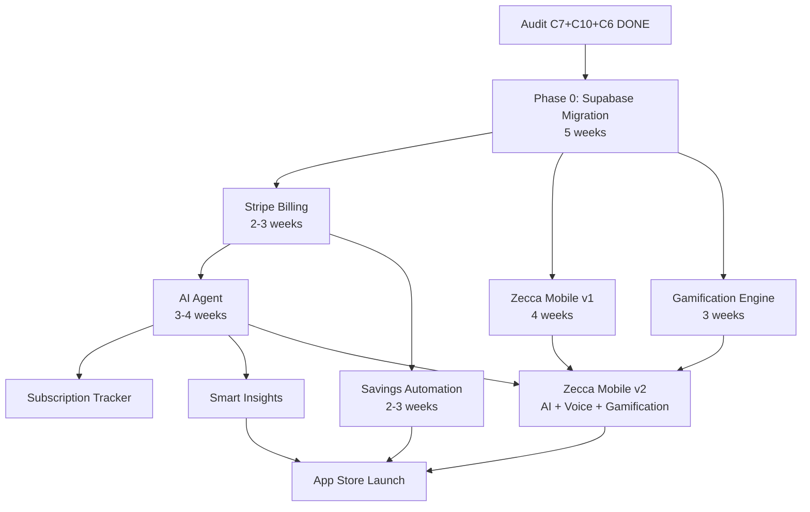

# Zecca — Unified Roadmap v2: Supabase Migration + Strategic Features

> **Created**: April 14, 2026
> **Status**: Approved
> **Supersedes**: `zecca-strategic-feature-plan.md`, previous unified roadmap v1
> **Inputs**: Health Audit (2026-04-12) + Zecca Strategic Plan + Supabase migration decision
> **Detail doc**: `zecca-phase0-supabase-migration.md` (week-by-week migration plan)

## Context

Three inputs converge:
1. **Health Audit**: Candidates 7, 10, 6 done. Remaining: C3 (Family), C2 (Deploy), C5 (Email), C4 (Admin), C1 (Stripe)
2. **Zecca Strategic Plan**: Brand, 10 features, competitive positioning
3. **Supabase Migration Decision**: Full migration eliminates C3, C5, most of C2 and C4

**Key decision**: Full Supabase migration (4-5 weeks) replaces audit remediation patchwork (6-8 weeks) AND leaves a cleaner foundation for every future feature. We take the pain upfront.

---

## New Stack (post-migration)

```
BEFORE                              AFTER
------                              -----
NestJS 11 + Prisma 6                Supabase (PostgreSQL + Auth + RLS + Storage + Realtime)
PostgreSQL (self-hosted)             PostgreSQL (Supabase, Frankfurt EU)
Redis                                Removed (Supabase Auth sessions)
Custom JWT + 5,875 LOC auth          Supabase Auth (0 LOC)
18,000+ LOC backend                  ~1,650 LOC Edge Functions
1,941 tests (many unreliable)        Fresh test suite (RLS + E2E)

Web: Next.js 15 + axios → NestJS    Web: Next.js 15 + @supabase/ssr → Supabase direct
Mobile: empty                        Mobile: Expo 52 + @supabase/supabase-js
Deploy: Docker self-host             Deploy: Vercel (web) + Supabase (data)
```

---

## Unified Timeline: 18 weeks

```
Phase 0: Supabase Migration (Weeks 1-5)
=========================================
  Week 1: DB schema + RLS policies + Auth setup
  Week 2: Seed data + DB functions + Web auth migration
  Week 3: Web data layer migration (services → Supabase client)
  Week 4: Banking Edge Functions + NestJS deletion
  Week 5: Testing + buffer

Phase 1: Stripe + Mobile Kickoff (Weeks 6-9)
==============================================
  TRACK A                          TRACK B
  Stripe billing module            Zecca mobile: auth + navigation
  - Free/Pro/Family tiers          - Supabase Auth SDK
  - Customer portal                - Expo Router tabs
  - SEPA + EU payments             - Quick expense entry (3 taps)
  - Webhook lifecycle              - Swipe to categorize

Phase 2: Mobile Core + AI Foundation (Weeks 10-13)
====================================================
  TRACK A                          TRACK B
  AI agent backend                 Zecca mobile: core screens
  - Edge Function for insights     - Transaction list
  - Auto-categorization ML         - Budget overview
  - Anomaly detection              - Account sync status
  - Subscription tracker           - Settings + preferences
  - Weekly digest (push + email)   - Offline-first sync

Phase 3: Gamification + Savings (Weeks 14-16)
===============================================
  - Achievement system, badges, family leaderboard
  - Financial score (0-100)
  - Challenges engine (no-spend week, 52-week, etc.)
  - Savings automation (round-ups, auto-save rules)
  - Visual savings jar
  - Mobile: gamification UI + push from AI agent

Phase 4: Growth + Launch (Weeks 17-18)
========================================
  - Voice input (Whisper + Claude)
  - Smart insights on mobile
  - Bill splitting
  - Zecca Academy (financial education)
  - App Store / Play Store submission
  - Marketing site on zecca.app
```

---

## Dependency Diagram



---

## What Phase 0 Eliminates

| Audit Item | Before (patch) | After (Supabase) |
|------------|---------------|-------------------|
| C3: Family multi-tenancy | 7-14 days, 15+ files | **ELIMINATED** — RLS policies |
| C5: Email verification | 2.5 days | **ELIMINATED** — Supabase Auth |
| C2: Self-host deployment | 4 days | **ELIMINATED** — Supabase + Vercel |
| C4: Admin/support MVP | 4 days | **REDUCED** — Supabase Dashboard |
| Auth bugs (5 findings) | 4 days fix | **ELIMINATED** — not our code |
| Test theater | Ongoing debt | **ELIMINATED** — fresh start |
| 13 familyId TODOs | Part of C3 | **ELIMINATED** — RLS |
| Coverage contradictions | Confusing | **ELIMINATED** — new test suite |

---

## Pricing Tiers (post-Stripe, Phase 1)

| Tier | Price | Features |
|------|-------|----------|
| Free | 0 | 1 user, manual entry, basic budgets |
| Zecca Pro | 4.99 EUR/mo | AI agent, voice, bank sync, analytics |
| Zecca Family | 7.99 EUR/mo | Up to 5 profiles, parental controls, shared goals |

---

## Brand Strategy

**Public**: Everything is **Zecca**
**Internal code**: Stays `money-wise` (repo, packages)
**Future**: Parent brand when CRM + marketing agents materialize

---

## Risk Callouts

1. **Supabase Edge Functions (Deno)**: SaltEdge is the only risk. Fallback: tiny Node.js micro-service on Fly.io
2. **RLS policy bugs**: Test-first with pgTAP before any data migration
3. **Web migration scope**: Systematic — grep all API calls, replace one service file at a time
4. **Supabase free tier**: 500MB DB, 50K MAU — more than enough for beta
5. **Timeline buffer**: Week 5 is pure buffer. If weeks 1-4 go clean, Phase 1 starts early

---

## Reference Documents

- `zecca-phase0-supabase-migration.md` — detailed week-by-week migration plan with code examples
- `zecca-strategic-feature-plan.md` — brand strategy + competitive analysis (still valid)
- `docs/audits/2026-04-12-health-audit.md` — original audit findings
- `docs/audits/2026-04-13-blocker-resolution-report.md` — A1-A5 resolution
